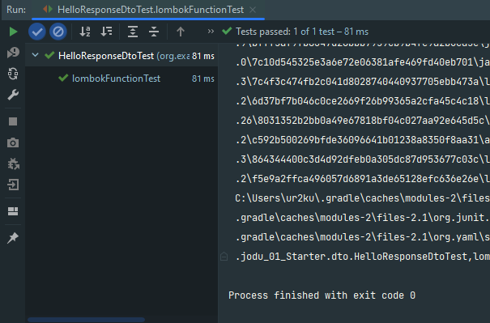
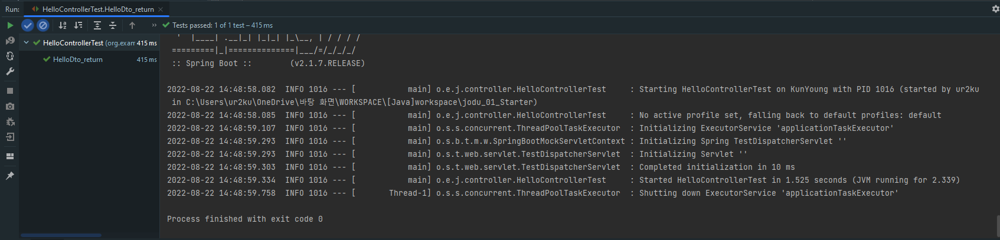

### 01 인텔리제이로 스프링 부트 시작하기

-----

#### 1.4 그레이들 프로젝트를 스프링 부트 프로젝트로 변경하기

<br/>

- 프로젝트의 플러그인 의존성 관리를 위한 설정

```
buildscript {
    ext {
        springBootVersion = '2.1.7.RELEASE'
    }
    repositories {
        mavenCentral()
        jcenter()
    }
    dependencies {
        classpath("org.springframework.boot:spring-boot-gradle-plugin:${springBootVersion}")
    }
}

plugins {
    id 'java'
}

group 'org.example'
version '1.0-SNAPSHOT'

repositories {
    mavenCentral()
}

dependencies {
    testImplementation 'org.junit.jupiter:junit-jupiter-api:5.8.1'
    testRuntimeOnly 'org.junit.jupiter:junit-jupiter-engine:5.8.1'
}

test {
    useJUnitPlatform()
}
```

| 키워드 | 내용                           |
|:----|:-----------------------------|
| ext | build.gradle 에서 사용하는 전역변수 설정 |

<br/>

- 앞서 선언한 프러그인 의존성 적용

```
apply plugin: 'java'
apply plugin: 'eclipse'
apply plugin: 'org.springframework.boot'
apply plugin: 'io.spring.dependency-management'
```

| 키워드 | 내용                      |
|:----|:------------------------|
| io.spring.dependency-management | 스프링 부트의 의존성을 관리해주는 플러그인 |


- 각종 의존성 (라이브러리) 들 추가를 위한 리포지터리 (원격저장소) 추가

```
repositories {
    mavenCentral()
    jcenter()
}

dependencies {
    implementation('org.springframework.boot:spring-boot-starter-web')
    testImplementation('org.springframework.boot:spring-boot-starter-test')
    testImplementation 'org.junit.jupiter:junit-jupiter-api:5.8.1'
    testRuntimeOnly 'org.junit.jupiter:junit-jupiter-engine:5.8.1'
}
```

> 최근엔 업로드 난이도 때문에 jcenter 도 많이 이용함 (직접 만든 라이브러리 업로드할 때 복잡함) <br/>
> dependencies 선언부에서 버전을 명시하지 않아야만  ``org.springframework.boot:spring-boot-gradle-plugin:${springBootVersion}`` 따라감

| 키워드 | 내용                      |
|:----|:------------------------|
| dependencies | 프로젝트 개발에 필요한 의존성 선언하는 곳 |

----
### 02 스프링 부트에서 테스트 코드를 작성하자

- 단위 테스트

| 키워드   | 내용                                                                                                                                                                                     |
|:------|:---------------------------------------------------------------------------------------------------------------------------------------------------------------------------------------|
| 단위테스트 | 기능 단위의 테스트 코드를 작성하는 것                                                                                                                                                                  |
| 장점    | - 개발단계 초기에 문제를 발견하게 도와준다. <br/> - 나중에 리팩토링이나 라이브러리 업그레이드 등에서 기존 기능이 올바르게 작동하는지 확인할 수 있다 (예, 회귀 테스트) <br/> - 기능에 대한 불확실성을 감소시킨다. <br/> - 시스템에 대한 실제 문서를 제공한다. (단위 테스트 자체를 문서로 사용할 수 있음) |

> 단위 테스트는 새로운 기능이 추가될 때, 기존 기능이 잘 작동되는 것을 보장해줌

<br/>

- 대표적 테스트 프레임워크

| 키워드     | 내용   |
|:--------|:-----|
| JUnit   | JAVA |
| DBUnit  | DB   |
| CppUnit | C++  |
| NUnit   | .net |

-----

#### 2.2 Hello Controller 테스트 코드 작성하기

- Application (메인)클래스 추가
```java
import org.springframework.boot.SpringApplication;
import org.springframework.boot.autoconfigure.SpringBootApplication;

@SpringBootApplication
public class Application {
    public static void main(String[] args) {
        SpringApplication.run(Application.class, args);
    }
}
```

| 키워드     | 내용                                                                                                   |
|:--------|:-----------------------------------------------------------------------------------------------------|
| @SpringBootApplication   | - 스프링 부트 자동 설정, 스프링 Bean 읽기와 생성을 모두 자동으로 설정함<br/> - 해당 어노테이션이 선언된 위치부터 설정을 읽어가기 때문에 프로젝트 최상단에서 선언할 것 |
|     SpringApplication.run | 내장 WAS 실행  (서버에 별도의 톰켓 설치 작업을 안해도 됨, 서버 실행 시 JAR Runnable File 만 클릭하면 실행할 수 있음)                      |

<br/>

- 간단한 컨트롤러 구현

```java
package org.example.jodu_01_Starter.controller;

import org.springframework.web.bind.annotation.GetMapping;
import org.springframework.web.bind.annotation.RestController;

@RestController
public class HelloController {

    @GetMapping("/hello")
    public String hello() {
        return "hello";
    }

}
```

> /hello 로 요청이 오면 문자열 hello 를 반환함

| 키워드             | 내용                                                                                                                                               |
|:----------------|:-------------------------------------------------------------------------------------------------------------------------------------------------|
| @RestController | - 컨트롤러를 JSON 을 반환하는 컨트롤러로 만들어줌 <br/> - 예전에 @ResponseBody 를 각 메소드마다 선언했던 것을 한번에 사용할 수 있게 해줌                                                       |
| @GetMapping     | - HTTP Method 인 Get 의 요청을 받을 수 있는 API 를 만들어줌 <br/> - 예전에 @RequestMapping(method = RequestMethod.GET) 으로 사용되던 거                                   |


<br/>

- 테스트 코드 구현

```java
import org.junit.Test;
import org.junit.runner.RunWith;
import org.springframework.beans.factory.annotation.Autowired;
import org.springframework.boot.test.autoconfigure.web.servlet.WebMvcTest;
import org.springframework.test.context.junit4.SpringRunner;
import org.springframework.test.web.servlet.MockMvc;
import org.springframework.test.web.servlet.request.MockMvcRequestBuilders;
import org.springframework.test.web.servlet.result.MockMvcResultMatchers;

@RunWith(SpringRunner.class)
@WebMvcTest(controllers = HelloController.class)
public class HelloControllerTest {

    @Autowired
    private MockMvc mvc;

    @Test
    public void hello() throws Exception {

        String hello = "hello";

        mvc.perform(MockMvcRequestBuilders.get("/hello"))
                .andExpect(MockMvcResultMatchers.status().isOk())
                .andExpect(MockMvcResultMatchers.content().string(hello));
    }

}
```

|키워드| 내용                                                                                                                                                        |
|:---|:----------------------------------------------------------------------------------------------------------------------------------------------------------|
|@RunWith(SpringRunner.class)| - 테스트를 진행할 때 JUnit에 내장된 실행자 외에 파라메타에 선언한 실행자를 실행 <br/> - SpringRunner 는 스프링 실행자를 사용 <br/> - 스프링부트 테스트와 JUnit 사이에 연결자 역할                                   |
| @WebMvcTest  | - 여러 스프링 테스트 어노테이션 중, Web (Spring MVC)에 집중할 수 있는 어노테이션 <br/> - 선언할 경우 @Controller, @ControllerAdvice 등 사용 가능 (@Service, @Component, @Repository 등은 사용 불가) |
| @Autowired  | - 스프링이 관리하는 빈 (Bean)을 주입 받음                                                                                                                               |
| private MockMvc mvc  | - 웹 API 를 테스트할 때 사용 <br/> - 스프링 MVC 테스트의 시작점 <br/> - 이 클래스를 통해 HTTP GET, POST 등에 대한 API 테스트를 할 수 있다.                                                      |
|  mvc.perform(MockMvcRequestBuilders.get("/hello")) | - MockMvc 를 통해 /hello 주소로 HTTP GET 요청을 함 <br/> - 체이닝이 지원되어 여러 검증 기능을 이어서 선언 가능                                                                            |
| .andExpect(MockMvcResultMatchers.status().isOk())  | - mvc.perform 의 결과를 검증 <br/> - HTTP Header 의 Status 를 검증 <br/> - 200, 404, 500 등의 상태 검증 <br/> - 여기선 OK (200) 인지 아닌지를 검중                                   |
| .andExpect(MockMvcResultMatchers.content().string(hello))  | - mvc.perform 의 결과를 검증 <br/> - 응답 본문의 내용을 검증 <br/> - Controller 에서 "hello" 를 리턴하는 지 검증                                                                    |

<br/>
---

#### 2.3 롬복 소개

> 롬복이란? 개발 시 자주 사용하는 Getter, Setter, 기본생성자, toString 등을 어노테이션으로 자동 생성해줌

     implementation 'org.projectlombok:lombok:'

프로젝트마다 build.gradle 라이브러리 추가, Enable annotation processing 체크하기

<br/>

---

#### 2.4 Hello Controller 코드를 롬복으로 전환하기

- HelloResponseDto 추가

```java
package org.example.jodu_01_Starter.dto;

import lombok.Getter;
import lombok.RequiredArgsConstructor;

@Getter
@RequiredArgsConstructor
public class HelloResponseDto {

    private final String name;

    private final int amount;
    
}
```

|keyword| description                                                          |
|:---|:---------------------------------------------------------------------|
|@Getter| - 선언된 모든 필드의 get 메소드를 생성해줌                                           |
|@RequiredArgsConstructor| - 선언된 모든 final 필드가 포함된 생성자를 생성해줌 <br/> - final 이 없는 필드는 생성자에 포함되지 않음 |

<br/>

- HelloResponseDto 테스트 코드 작성

```java
package org.example.jodu_01_Starter.dto;

import org.junit.Test;

import static org.assertj.core.api.AssertionsForClassTypes.assertThat;

public class HelloResponseDtoTest {

    @Test
    public void lombokFunctionTest() {

        /*given*/
        String name = "test";

        int amount = 1000;


        /*when*/
        HelloResponseDto dto = new HelloResponseDto(name, amount);


        /*then*/
        assertThat(dto.getName()).isEqualTo(name);
        assertThat(dto.getAmount()).isEqualTo(amount);

    }
}
```
|keyword| description                                                                                                                 |
|:---|:----------------------------------------------------------------------------------------------------------------------------|
|assertThat| - assertj 라는 테스트 검증 라이이브러리의 검증 메소드임. <br/> - 검증하고 싶은 대상을 매서드 인자로 받음 <br/> - 메소드 체이닝이 지원되어 isEqualTo 와 같이 메소드를 이어서 사용할 수 있다. |
|isEqualTo| - assertj 의 동등 비교 메소드임. <br/> - assertThat 에 있는 값과 isEqaulTo 의 값을 비교해서 같을 때만 성공!                                            |

> JUnit 과 비교했을 때 assertj 의 장점
> - CoreMatchers 와 달리 추가적으로 라이브러리가 필요하지 않다.
>   - Junit 의 assertThat 을 쓰게 되면 is() 와 같이 CoreMatchers 라이브러리가 필요하다.
> - 자동완성이 좀 더 확실하게 지원된다.
>   - IDE 에서는 CoreMatchers 와 같은 Mather 라이브러리의 자동완성 지원이 약하다.

- 실행결과


<br/>

- HelloController 에서 ResponseDTO 사용

```java
    @GetMapping("/hello/dto")
    public HelloResponseDto HelloDto(@RequestParam("name") String name, @RequestParam("amount") int amount) {
        return new HelloResponseDto(name, amount);
    }
```
|keyword| description                                                                                                                            |
|:---|:---------------------------------------------------------------------------------------------------------------------------------------|
|@ReqeustParam| - 외부에서 API 로 넘긴 파라미터를 가져오는 어노테이션임 <br/> - 여기서는 외부에서 name (@RequestParam("name")) 이란 이름으로 넘긴 파라미터를 메소드 파라미터 name(String name) 에 저장하게 됨. |

<br/>

- HelloController API 테스트 

```java
package org.example.jodu_01_Starter.controller;

import org.junit.Test;
import org.junit.runner.RunWith;
import org.springframework.beans.factory.annotation.Autowired;
import org.springframework.boot.test.autoconfigure.web.servlet.WebMvcTest;
import org.springframework.test.context.junit4.SpringRunner;
import org.springframework.test.web.servlet.MockMvc;
import org.springframework.test.web.servlet.request.MockMvcRequestBuilders;
import org.springframework.test.web.servlet.result.MockMvcResultMatchers;

import static org.hamcrest.Matchers.is;
import static org.springframework.test.web.servlet.result.MockMvcResultMatchers.jsonPath;

@RunWith(SpringRunner.class)
@WebMvcTest(controllers = HelloController.class)
public class HelloControllerTest {

    @Autowired
    private MockMvc mvc;

    @Test
    public void hello() throws Exception {

        String hello = "hello";

        mvc.perform(MockMvcRequestBuilders.get("/hello"))
                .andExpect(MockMvcResultMatchers.status().isOk())
                .andExpect(MockMvcResultMatchers.content().string(hello));
    }

    @Test
    public void HelloDto_return() throws Exception {

        String name = "hello";

        int amount = 1000;

        mvc.perform(MockMvcRequestBuilders.get("/hello/dto").param("name", name).param("amount", String.valueOf(amount)))
                .andExpect(MockMvcResultMatchers.status().isOk())
                .andExpect(jsonPath("$.name", is(name)))
                .andExpect(jsonPath("$.amount", is(amount)));


    }

}
```

| keyword  | description                                                                                                             |
|:---------|:------------------------------------------------------------------------------------------------------------------------|
| param    | - API 테스트할 때 사용될 요청 파라미터를 설정한다. <br/> - 값은 String 만 허용됨 <br/> - 따라서 숫자/날짜 등의 데이터를 등록할 때는 문자열로 변경해야 함                    |
| jsonPath | - JSON 응답값을 필드별로 검증할 수 있는 메서드이다. <br/> - $ 을 기준으로 필드명을 명시한다. <br/> - 여기서는 bane 과 amount 를 검증하니 $.name, $.amount 로 검증한다. |

- api 테스트 결과



----
### 03 스프링부트에서 JPA로 데이터베이스 다뤄보자

> - MyBatis, iBatis: SQL 매퍼
> - JPA : ORM (Object Relational Mapping)

#### JPA 소개

|키워드| 내용                                                                          |
|:---|:----------------------------------------------------------------------------|
|RDB| 어떻게 데이터를 저장할지에 초점                                                           |
|객체지향 프로그래밍 언어| 메시지를 기반으로 기능과 속성을 한 곳에서 관리하는 기술 -> 패러다임 불일치                                 |
|JPA| 객체지향적으로 프로그래밍하고 SQL을 대신 생성 -> SQL 독립적으로 개발 가능                               |
|Spring Data JPA| JPA <- Hibernate <- Spring Data JPA  <br/> - 구현 교체의 용이성 <br/> - 저장소 교체의 용이성 |

> - 구현교체의 용이성: 유행이 지나면 Hibernate 외에 다른 구현체로 쉽게 교체하기 위함 <br/>
> - 저장소 교체의 용이성: 관계형 데이터베이스 외에 다른 저장소로 쉽게 교체하기 위함 <br/>
> -> 서비스 초기엔 RDB로 모든 기능 처리 가능하지만 트래픽 커질 수록 RDB로 감당 안됨 (MongoDB로 교체 필요성 spring data mongodb로 의존성 교체)
> - save(), findAll().. 등의 인터페이스를 사용하는 경우 저장소가 교체되어도 기본적인 기능은 변경할 것이 없다.

---

#### 요구사항 분석

| 게시판 기능 | 회원 기능            |
|:-------|:-----------------|
| 게시글 조회 | 구글/네이버 로그인       |
| 게시글 등록 | 로그인한 사용자 글 작성 권한 |
| 게시글 수정 | 본인 작성 글에 대한 권한 관리 |
| 게시글 삭제 |                  |

<br/>


|키워드|내용|
|:---|:---|
|||


