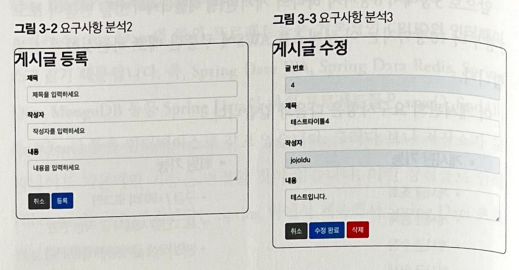
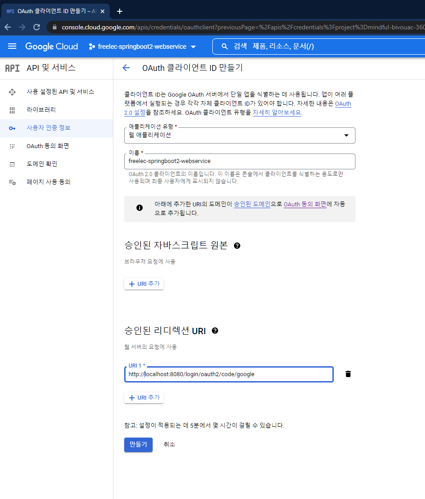

### 01 인텔리제이로 스프링 부트 시작하기

-----

#### 1.4 그레이들 프로젝트를 스프링 부트 프로젝트로 변경하기

<br/>

- 프로젝트의 플러그인 의존성 관리를 위한 설정

```
buildscript {
    ext {
        springBootVersion = '2.1.7.RELEASE'
    }
    repositories {
        mavenCentral()
        jcenter()
    }
    dependencies {
        classpath("org.springframework.boot:spring-boot-gradle-plugin:${springBootVersion}")
    }
}

plugins {
    id 'java'
}

group 'org.example'
version '1.0-SNAPSHOT'

repositories {
    mavenCentral()
}

dependencies {
    testImplementation 'org.junit.jupiter:junit-jupiter-api:5.8.1'
    testRuntimeOnly 'org.junit.jupiter:junit-jupiter-engine:5.8.1'
}

test {
    useJUnitPlatform()
}
```

| 키워드 | 내용                           |
|:----|:-----------------------------|
| ext | build.gradle 에서 사용하는 전역변수 설정 |

<br/>

- 앞서 선언한 프러그인 의존성 적용

```
apply plugin: 'java'
apply plugin: 'eclipse'
apply plugin: 'org.springframework.boot'
apply plugin: 'io.spring.dependency-management'
```

| 키워드 | 내용                      |
|:----|:------------------------|
| io.spring.dependency-management | 스프링 부트의 의존성을 관리해주는 플러그인 |


- 각종 의존성 (라이브러리) 들 추가를 위한 리포지터리 (원격저장소) 추가

```
repositories {
    mavenCentral()
    jcenter()
}

dependencies {
    implementation('org.springframework.boot:spring-boot-starter-web')
    testImplementation('org.springframework.boot:spring-boot-starter-test')
    testImplementation 'org.junit.jupiter:junit-jupiter-api:5.8.1'
    testRuntimeOnly 'org.junit.jupiter:junit-jupiter-engine:5.8.1'
}
```

> 최근엔 업로드 난이도 때문에 jcenter 도 많이 이용함 (직접 만든 라이브러리 업로드할 때 복잡함) <br/>
> dependencies 선언부에서 버전을 명시하지 않아야만  ``org.springframework.boot:spring-boot-gradle-plugin:${springBootVersion}`` 따라감

| 키워드 | 내용                      |
|:----|:------------------------|
| dependencies | 프로젝트 개발에 필요한 의존성 선언하는 곳 |

----
### 02 스프링 부트에서 테스트 코드를 작성하자

- 단위 테스트

| 키워드   | 내용                                                                                                                                                                                     |
|:------|:---------------------------------------------------------------------------------------------------------------------------------------------------------------------------------------|
| 단위테스트 | 기능 단위의 테스트 코드를 작성하는 것                                                                                                                                                                  |
| 장점    | - 개발단계 초기에 문제를 발견하게 도와준다. <br/> - 나중에 리팩토링이나 라이브러리 업그레이드 등에서 기존 기능이 올바르게 작동하는지 확인할 수 있다 (예, 회귀 테스트) <br/> - 기능에 대한 불확실성을 감소시킨다. <br/> - 시스템에 대한 실제 문서를 제공한다. (단위 테스트 자체를 문서로 사용할 수 있음) |

> 단위 테스트는 새로운 기능이 추가될 때, 기존 기능이 잘 작동되는 것을 보장해줌

<br/>

- 대표적 테스트 프레임워크

| 키워드     | 내용   |
|:--------|:-----|
| JUnit   | JAVA |
| DBUnit  | DB   |
| CppUnit | C++  |
| NUnit   | .net |

-----

#### 2.2 Hello Controller 테스트 코드 작성하기

- Application (메인)클래스 추가
```java
import org.springframework.boot.SpringApplication;
import org.springframework.boot.autoconfigure.SpringBootApplication;

@SpringBootApplication
public class Application {
    public static void main(String[] args) {
        SpringApplication.run(Application.class, args);
    }
}
```

| 키워드     | 내용                                                                                                   |
|:--------|:-----------------------------------------------------------------------------------------------------|
| @SpringBootApplication   | - 스프링 부트 자동 설정, 스프링 Bean 읽기와 생성을 모두 자동으로 설정함<br/> - 해당 어노테이션이 선언된 위치부터 설정을 읽어가기 때문에 프로젝트 최상단에서 선언할 것 |
|     SpringApplication.run | 내장 WAS 실행  (서버에 별도의 톰켓 설치 작업을 안해도 됨, 서버 실행 시 JAR Runnable File 만 클릭하면 실행할 수 있음)                      |

<br/>

- 간단한 컨트롤러 구현

```java
package org.example.jodu_01_Starter.controller;

import org.springframework.web.bind.annotation.GetMapping;
import org.springframework.web.bind.annotation.RestController;

@RestController
public class HelloController {

    @GetMapping("/hello")
    public String hello() {
        return "hello";
    }

}
```

> /hello 로 요청이 오면 문자열 hello 를 반환함

| 키워드             | 내용                                                                                                                                               |
|:----------------|:-------------------------------------------------------------------------------------------------------------------------------------------------|
| @RestController | - 컨트롤러를 JSON 을 반환하는 컨트롤러로 만들어줌 <br/> - 예전에 @ResponseBody 를 각 메소드마다 선언했던 것을 한번에 사용할 수 있게 해줌                                                       |
| @GetMapping     | - HTTP Method 인 Get 의 요청을 받을 수 있는 API 를 만들어줌 <br/> - 예전에 @RequestMapping(method = RequestMethod.GET) 으로 사용되던 거                                   |


<br/>

- 테스트 코드 구현

```java
import org.junit.Test;
import org.junit.runner.RunWith;
import org.springframework.beans.factory.annotation.Autowired;
import org.springframework.boot.test.autoconfigure.web.servlet.WebMvcTest;
import org.springframework.test.context.junit4.SpringRunner;
import org.springframework.test.web.servlet.MockMvc;
import org.springframework.test.web.servlet.request.MockMvcRequestBuilders;
import org.springframework.test.web.servlet.result.MockMvcResultMatchers;

@RunWith(SpringRunner.class)
@WebMvcTest(controllers = HelloController.class)
public class HelloControllerTest {

    @Autowired
    private MockMvc mvc;

    @Test
    public void hello() throws Exception {

        String hello = "hello";

        mvc.perform(MockMvcRequestBuilders.get("/hello"))
                .andExpect(MockMvcResultMatchers.status().isOk())
                .andExpect(MockMvcResultMatchers.content().string(hello));
    }

}
```

|키워드| 내용                                                                                                                                                        |
|:---|:----------------------------------------------------------------------------------------------------------------------------------------------------------|
|@RunWith(SpringRunner.class)| - 테스트를 진행할 때 JUnit에 내장된 실행자 외에 파라메타에 선언한 실행자를 실행 <br/> - SpringRunner 는 스프링 실행자를 사용 <br/> - 스프링부트 테스트와 JUnit 사이에 연결자 역할                                   |
| @WebMvcTest  | - 여러 스프링 테스트 어노테이션 중, Web (Spring MVC)에 집중할 수 있는 어노테이션 <br/> - 선언할 경우 @Controller, @ControllerAdvice 등 사용 가능 (@Service, @Component, @Repository 등은 사용 불가) |
| @Autowired  | - 스프링이 관리하는 빈 (Bean)을 주입 받음                                                                                                                               |
| private MockMvc mvc  | - 웹 API 를 테스트할 때 사용 <br/> - 스프링 MVC 테스트의 시작점 <br/> - 이 클래스를 통해 HTTP GET, POST 등에 대한 API 테스트를 할 수 있다.                                                      |
|  mvc.perform(MockMvcRequestBuilders.get("/hello")) | - MockMvc 를 통해 /hello 주소로 HTTP GET 요청을 함 <br/> - 체이닝이 지원되어 여러 검증 기능을 이어서 선언 가능                                                                            |
| .andExpect(MockMvcResultMatchers.status().isOk())  | - mvc.perform 의 결과를 검증 <br/> - HTTP Header 의 Status 를 검증 <br/> - 200, 404, 500 등의 상태 검증 <br/> - 여기선 OK (200) 인지 아닌지를 검중                                   |
| .andExpect(MockMvcResultMatchers.content().string(hello))  | - mvc.perform 의 결과를 검증 <br/> - 응답 본문의 내용을 검증 <br/> - Controller 에서 "hello" 를 리턴하는 지 검증                                                                    |

<br/>
---

#### 2.3 롬복 소개

> 롬복이란? 개발 시 자주 사용하는 Getter, Setter, 기본생성자, toString 등을 어노테이션으로 자동 생성해줌

     implementation 'org.projectlombok:lombok:'

프로젝트마다 build.gradle 라이브러리 추가, Enable annotation processing 체크하기

<br/>

---

#### 2.4 Hello Controller 코드를 롬복으로 전환하기

- HelloResponseDto 추가

```java
package org.example.jodu_01_Starter.dto;

import lombok.Getter;
import lombok.RequiredArgsConstructor;

@Getter
@RequiredArgsConstructor
public class HelloResponseDto {

    private final String name;

    private final int amount;
    
}
```

|keyword| description                                                          |
|:---|:---------------------------------------------------------------------|
|@Getter| - 선언된 모든 필드의 get 메소드를 생성해줌                                           |
|@RequiredArgsConstructor| - 선언된 모든 final 필드가 포함된 생성자를 생성해줌 <br/> - final 이 없는 필드는 생성자에 포함되지 않음 |

<br/>

- HelloResponseDto 테스트 코드 작성

```java
package org.example.jodu_01_Starter.dto;

import org.junit.Test;

import static org.assertj.core.api.AssertionsForClassTypes.assertThat;

public class HelloResponseDtoTest {

    @Test
    public void lombokFunctionTest() {

        /*given*/
        String name = "test";

        int amount = 1000;


        /*when*/
        HelloResponseDto dto = new HelloResponseDto(name, amount);


        /*then*/
        assertThat(dto.getName()).isEqualTo(name);
        assertThat(dto.getAmount()).isEqualTo(amount);

    }
}
```
|keyword| description                                                                                                                 |
|:---|:----------------------------------------------------------------------------------------------------------------------------|
|assertThat| - assertj 라는 테스트 검증 라이이브러리의 검증 메소드임. <br/> - 검증하고 싶은 대상을 매서드 인자로 받음 <br/> - 메소드 체이닝이 지원되어 isEqualTo 와 같이 메소드를 이어서 사용할 수 있다. |
|isEqualTo| - assertj 의 동등 비교 메소드임. <br/> - assertThat 에 있는 값과 isEqaulTo 의 값을 비교해서 같을 때만 성공!                                            |

> JUnit 과 비교했을 때 assertj 의 장점
> - CoreMatchers 와 달리 추가적으로 라이브러리가 필요하지 않다.
>   - Junit 의 assertThat 을 쓰게 되면 is() 와 같이 CoreMatchers 라이브러리가 필요하다.
> - 자동완성이 좀 더 확실하게 지원된다.
>   - IDE 에서는 CoreMatchers 와 같은 Mather 라이브러리의 자동완성 지원이 약하다.

- 실행결과


<br/>

- HelloController 에서 ResponseDTO 사용

```java
    @GetMapping("/hello/dto")
    public HelloResponseDto HelloDto(@RequestParam("name") String name, @RequestParam("amount") int amount) {
        return new HelloResponseDto(name, amount);
    }
```
|keyword| description                                                                                                                            |
|:---|:---------------------------------------------------------------------------------------------------------------------------------------|
|@ReqeustParam| - 외부에서 API 로 넘긴 파라미터를 가져오는 어노테이션임 <br/> - 여기서는 외부에서 name (@RequestParam("name")) 이란 이름으로 넘긴 파라미터를 메소드 파라미터 name(String name) 에 저장하게 됨. |

<br/>

- HelloController API 테스트 

```java
package org.example.jodu_01_Starter.controller;

import org.junit.Test;
import org.junit.runner.RunWith;
import org.springframework.beans.factory.annotation.Autowired;
import org.springframework.boot.test.autoconfigure.web.servlet.WebMvcTest;
import org.springframework.test.context.junit4.SpringRunner;
import org.springframework.test.web.servlet.MockMvc;
import org.springframework.test.web.servlet.request.MockMvcRequestBuilders;
import org.springframework.test.web.servlet.result.MockMvcResultMatchers;

import static org.hamcrest.Matchers.is;
import static org.springframework.test.web.servlet.result.MockMvcResultMatchers.jsonPath;

@RunWith(SpringRunner.class)
@WebMvcTest(controllers = HelloController.class)
public class HelloControllerTest {

    @Autowired
    private MockMvc mvc;

    @Test
    public void hello() throws Exception {

        String hello = "hello";

        mvc.perform(MockMvcRequestBuilders.get("/hello"))
                .andExpect(MockMvcResultMatchers.status().isOk())
                .andExpect(MockMvcResultMatchers.content().string(hello));
    }

    @Test
    public void HelloDto_return() throws Exception {

        String name = "hello";

        int amount = 1000;

        mvc.perform(MockMvcRequestBuilders.get("/hello/dto").param("name", name).param("amount", String.valueOf(amount)))
                .andExpect(MockMvcResultMatchers.status().isOk())
                .andExpect(jsonPath("$.name", is(name)))
                .andExpect(jsonPath("$.amount", is(amount)));


    }

}
```

| keyword  | description                                                                                                             |
|:---------|:------------------------------------------------------------------------------------------------------------------------|
| param    | - API 테스트할 때 사용될 요청 파라미터를 설정한다. <br/> - 값은 String 만 허용됨 <br/> - 따라서 숫자/날짜 등의 데이터를 등록할 때는 문자열로 변경해야 함                    |
| jsonPath | - JSON 응답값을 필드별로 검증할 수 있는 메서드이다. <br/> - $ 을 기준으로 필드명을 명시한다. <br/> - 여기서는 bane 과 amount 를 검증하니 $.name, $.amount 로 검증한다. |

- api 테스트 결과


----
### 03 스프링부트에서 JPA로 데이터베이스 다뤄보자

> - MyBatis, iBatis: SQL 매퍼
> - JPA : ORM (Object Relational Mapping)

#### JPA 소개

|키워드| 내용                                                                          |
|:---|:----------------------------------------------------------------------------|
|RDB| 어떻게 데이터를 저장할지에 초점                                                           |
|객체지향 프로그래밍 언어| 메시지를 기반으로 기능과 속성을 한 곳에서 관리하는 기술 -> 패러다임 불일치                                 |
|JPA| 객체지향적으로 프로그래밍하고 SQL을 대신 생성 -> SQL 독립적으로 개발 가능                               |
|Spring Data JPA| JPA <- Hibernate <- Spring Data JPA  <br/> - 구현 교체의 용이성 <br/> - 저장소 교체의 용이성 |

> - 구현교체의 용이성: 유행이 지나면 Hibernate 외에 다른 구현체로 쉽게 교체하기 위함 <br/>
> - 저장소 교체의 용이성: 관계형 데이터베이스 외에 다른 저장소로 쉽게 교체하기 위함 <br/>
> -> 서비스 초기엔 RDB로 모든 기능 처리 가능하지만 트래픽 커질 수록 RDB로 감당 안됨 (MongoDB로 교체 필요성 spring data mongodb로 의존성 교체)
> - save(), findAll().. 등의 인터페이스를 사용하는 경우 저장소가 교체되어도 기본적인 기능은 변경할 것이 없다.

---

#### 요구사항 분석

| 게시판 기능 | 회원 기능            |
|:-------|:-----------------|
| 게시글 조회 | 구글/네이버 로그인       |
| 게시글 등록 | 로그인한 사용자 글 작성 권한 |
| 게시글 수정 | 본인 작성 글에 대한 권한 관리 |
| 게시글 삭제 |                  |

<br/>





------

#### 3.2 프로젝트에 Spring Data Jpa 적용하기

- spring-boot-starter-data-jpa, com.h2database:h2 의존성 등록
```
implementation 'org.springframework.boot:spring-boot-starter-data-jpa'
implementation 'com.h2database:h2'
```

|키워드| 내용                                                                                                                     |
|:---|:-----------------------------------------------------------------------------------------------------------------------|
|spring-boot-starter-data-jpa| - 스프링 부트용 Spring Data Jpa 추상화 라이브러리 <br/> - 스프링 부트 버전에 맞춰 자동으로 JPA 관련 라이브러리들의 버전을 관리해줌                                 |
|h2| - 인메모리 RDB <br/> - 별도의 설치가 필요 없이 프로젝트 의존성만으로 관리 가능 <br/> - 메모리에서 실행되기 때문에 애플리케이션 재시작할 때마다 초기화된다는 점을 이용하여 테스트 용도로 주로 사용 |

<br/>

- Domain (Entity) 클래스 작성

```java
import lombok.AllArgsConstructor;
import lombok.Builder;
import lombok.Getter;
import lombok.NoArgsConstructor;

import javax.persistence.*;

@Builder
@NoArgsConstructor
@AllArgsConstructor
@Getter
@Entity
public class Posts {

    @Id
    @GeneratedValue(strategy = GenerationType.IDENTITY)
    private Long id;

    @Column(length = 500, nullable = false)
    private String title;

    @Column(columnDefinition = "TEXT", nullable = false)
    private String content;

    private String author;

}
```

| 키워드                | 내용                                                                                                                                                                            |
|:-------------------|:------------------------------------------------------------------------------------------------------------------------------------------------------------------------------|
| Entity             | - 데이블과 링크될 클래스임을 나타냄 <br/> - 기본값으로 클래스의 카멜케이스 이름을 언더스코어 네이밍 (_) 으로 데이블 이름을 매칭 <br/> - ex) SalesManager.java -> sales_manager table                                            |
| @Id                | - 해당 테이블의 PK 필드를 나타냄                                                                                                                                                          |
| @GeneratedValue    | - PK의 생성 규칙을 나타냄 <br/> - 스프링부트 2.0 에서는 GenerationType.IDENTITY 옵션을 추가해야만 auto_increment 가 됨                                                                                   |
| @Column            | - 테이블의 칼럼을 나타내며 굳이 선언하지 않더라도 해당 클래스의 필드는 모두 칼럼이 됨 <br/> - 기본값 외에 추가로 변경이 필요한 옵션이 있으면 사용 <br/> - 문자열의 경우 VARCHAR(255) 가 기본값인데, 사이즈를 500으로 늘리고 싶거나 타입을 TEXT로 변경하고 싶거나 등의 경우에 사용 |
| @NoArgsConstructor | - 기본 생성자 자동 추가 <br/> - Constructor 와 같은 효과                                                                                                                                    |
| @Getter            | - 클래스 내 모든 필드의 Getter 메소드를 자동 생성                                                                                                                                              |
|@Builder| - 해당 클래스의 빌더 패턴 클래스를 생성 <br/> - 생성자 상단에 선언 시 생성자에 포함된 필드만 빌더에 포함                                                                                                              |

> Entity 클래스에서 절대 Setter 메소드를 만들지 마라. 대신, 해당 필드의 값 변경 필요시 명확히 그 목적과 의도를 나타낼 수 있는 메소드를 추가해라

<br/>

- 잘못된 사용 예

```java
public class Order {
    public void setStatus (boolean status) {
        this.status = status;
    }
    
    public void 주문서비스의_취소이벤트() {
        order.setStatus(false);
    }
}
```


- 올바른 사용 에
```java
public class Order {
    public void cancelOrder () {
        this.status = false;
    }
    
    public void 주문서비스의_취소이벤트() {
        order.cancelOrder();
    }
}
```

<br/>

- JpaRepository 생성

|키워드| 내용                     |
|:---|:-----------------------|
|JpaRepository| Posts 클래스로 DB에 접근하게 해줌 |

> JPA 에선 Repository 라고 부르며 인터페이스로 생성됨. 반면 ibatis 나 MyBatis 등에서 DAO 라고 불림 <br/>
> JpaRepository<Entity, PK Type> 을 상속하면 기본적인 CRUD 메소드가 자동으로 생성됨 <br/>
> 나중에 프로젝트 규모가 커져 도메인별로 프로젝트를 분리해야 한다면 Entity 클래스와 기본 Repository 는 함께 움직여야 하므로 도메인 패키지에서 함께 관리할 것

---

#### 3.3 Spring Data JPA 테스트 코드 작성하기

```java
import org.junit.After;
import org.junit.Test;
import org.junit.runner.RunWith;
import org.springframework.beans.factory.annotation.Autowired;
import org.springframework.boot.test.context.SpringBootTest;
import org.springframework.test.context.junit4.SpringRunner;

import java.util.List;

import static org.assertj.core.api.AssertionsForClassTypes.assertThat;

@RunWith(SpringRunner.class)
@SpringBootTest
public class PostRepositoryTest {

    @Autowired
    PostsRepository postsRepository;

    @After
    public void cleanup() {
        postsRepository.deleteAll();
    }

    @Test
    public void 게시글저장_불러오기() {

        // given
        String title = "테스트 게시글";
        String content = "테스트 본문";

        postsRepository.save(Posts.builder()
                .title(title)
                .content(content)
                .author("jojodu@gmail.com")
                .build());

        // when
        List<Posts> postsList = postsRepository.findAll();

        // then
        Posts posts = postsList.get(0);
        assertThat(posts.getTitle()).isEqualTo(title);
        assertThat(posts.getContent()).isEqualTo(content);

    }

}
```

| 키워드    | 내용                                                                                                                                                                      |
|:-------|:------------------------------------------------------------------------------------------------------------------------------------------------------------------------|
| @After | - Junit 에서 단위 테스트가 끝날 때마다 수행되는 메소드를 지정 <br/> - 보통은 배포 전 전체 테스트를 수행할 때 테스트간 데이터 침범을 막기 위해 사용 <br/> - 여러 테스트가 동시에 수행되면 DB 인 H2 에 데이터가 그대로 남아 있어 다음 테스트 실행 시 테스트가 실패할 수 있다 |
| postsRepository.save       | - 테이블 posts 에 insert/update 쿼리를 실행한다 <br/> - id 값이 있다면 update 가 없다면 insert 쿼리가 실행된다                                                                                     |
|  postsRepository.findAll      | - 테이블 posts 에 잇는 모든 데이터를 조회해오는 메소드이다                                                                                                                                    |

> - 실행된 쿼리 로그 확인: ```spring.jpa.show-sql=true```

> - 출력되는 쿼리 로그를 MySQL 버전으로 변경 : ```spring.jpa.properties.hibernate.dialect=org.hibernate.dialect.MySQL5InnoDBDialect```

---

#### 3.4 등록/수정/조회 API 만들기

- API 만들기 위해 총 3개의 클래스 필요
> - Request 데이터를 받을 DTO
> - API 요청을 받을 Controller
> - 트랜잭션, 도메인 기능 간의 순서를 보장하는 Service


> - Web Layer
>     - 흔히 사용하는 컨트롤러 (@Controller)와 JPS/Freemaker 등의 뷰 템플릿 영역임.
>     - 이외에도 필터 (@Filter), 인터셉터, 컨트롤러 어드바이스 (@Controller/Advice) 등 외부 요청과 응답에 대한 전반적인 영역을 이야기함
> - Service Layer
>   - @Service 에 사용되는 서비스 영역이다.
>   - 일반적으로 Controller 와 DAO 의 중간 영역에서 사용됨.
>   - @Transactional 이 사용되어야 하는 영역이기도 함
> - Repository Layer
>   - Database 와 같이 데이터 저장소에 접근하는 영역임
>   - 기존에 DAO (Data Access Object) 영역으로 이해하면 됨
> - Dtos
>   - Dto (Data Transfer Object)는 계층 간에 데이터 교환을 위한 객체를 이야기하며 Dtos 는 이들의 영역을 애기함
>   - 예를 들어 뷰 템플릿 엔진에서 사용될 객체나 Repository Layer 에서 결과로 넘겨준 객체 등이 이들을 말함.
> - Domain Model
>   - 도메인이라 불리는 개발 대상을 모든 사람이 동일한 관점에서 이해할 수 있고 공유할 수 있도록 단순화시킨 것을 도메인 모델이라고 한다
>   - 예를 들어 택시 앱의 경우 배차, 탑승, 요금 등이 모두 도메인이 될 수 있다
>   - @Entity 가 사용된 영역 역시 도메인 모델이라고 이해하면 됨
>   - 다만, 무조건 데이터베이스의 테이블과 관계가 있어야 하는 것은 아니다
>   - VO 처럼 값 객체들도 이 영역에 해당됨

<br/>

- 도메인 계층에서 로직을 처리하는 이유 <br/> 
 -ex) 주문 취소 로직

- 슈도 코드
```java
@Transactional
public Order cancelOrder(int orderId){
        // 데이터베이스로부터 주문정보, 결제정보, 배송정보 조회
        // 배송 취소 해야 하는지 확인
        // 배송중이라면 취소로 변경
        // 각 테이블에 취소 상태 Update
}
```

- 서비스 계층에서 모든 로직을 처리할 경우
```java
@Transactional
public Order cancelOrder(int orderId){
    
    OrderDto order = ordersDao.selectOrders(orderId);
    BillingDto billing = billingDao.selectBilling(orderId);
    DeliveryDto delivery = deliveryDao.selectDelivery(orderId);
        
    String deliveryStatus = delivery.getStatus();
    
    if("IN_PROGRESS".equals(deliveryStatus)) {
        delivery.setStatus("CANCEL");
        deliveryDao.update(delivery);
    }
    
    order.setStatus("CANCEL");
    ordersDao.update(order);
    
    billing.setStatus("CANCEL");
    deliveryDao.update(billing);
    
    return order;
}
```

> 모든 로직이 서비스 클래스 내부에서 처리됨. 그러다 보니 서비스 계층이 무의미하며, 객체란 단순 데이터 덩어리 역할만..

- 로직을 도메인 모델에서 처리할 경우

```java
@Transactional
public Order cancelOrder(int orderId) {
    
    Orders order = ordersRepository.findById(orderId);
    Billing billing = billingRepository.findByOrderId(orderId);
    Delivery delivery = deliveryRepository.findByOrderId(orderId);
    
    delivery cancel();
    
    order.cancel();
    billing.cancel();
    
    return order;
    
}
```

> order, billing, delivery 가 각자 본인의 취소 이벤트 처리를 하며, 서비스 메소드는 트랜잭션과 도메인 간의 순서만 보장해 준다.

<br/>

---

###### 등록, 수정, 삭제 기능 만들기

---

#### - 등록 기능
- PostApiController

```java
import lombok.RequiredArgsConstructor;
import org.example.jodu_01_Starter.service.posts.PostsService;
import org.example.jodu_01_Starter.web.dto.PostSaveRequestDto;
import org.springframework.web.bind.annotation.PostMapping;
import org.springframework.web.bind.annotation.RequestBody;
import org.springframework.web.bind.annotation.RestController;

@RequiredArgsConstructor
@RestController
public class PostApiController {

    private final PostsService postsService;

    @PostMapping("/api/v1/posts")
    public Long save(@RequestBody PostSaveRequestDto requestDto) {

        return postsService.save(requestDto);

    }

}
```

- PostsService
```java
import lombok.RequiredArgsConstructor;
import org.example.jodu_01_Starter.domain.posts.PostsRepository;
import org.example.jodu_01_Starter.web.dto.PostSaveRequestDto;
import org.springframework.stereotype.Service;

import javax.transaction.Transactional;

@RequiredArgsConstructor
@Service
public class PostsService {

    private final PostsRepository postsRepository;

    @Transactional
    public Long save(PostSaveRequestDto requestDto) {

        return postsRepository.save(requestDto.toEntity()).getId();

    }

}
```

> @RequiredArgsConstructor: final 이 선언된 모든 필드를 인자값으로 하는 생성자를 생성해줌 (bean 으로 등록)

- PostsSaveRequestDto

```java
import lombok.AllArgsConstructor;
import lombok.Builder;
import lombok.Getter;
import lombok.NoArgsConstructor;
import org.example.jodu_01_Starter.domain.posts.Posts;

@Getter
@NoArgsConstructor
@AllArgsConstructor
@Builder
public class PostSaveRequestDto {

    private String title;

    private String content;

    private String author;


    public Posts toEntity() {
        return Posts.builder()
                .title(title)
                .content(content)
                .author(author)
                .build();
    }
}
```

- PostsApiControllerTest

```java
import org.example.jodu_01_Starter.domain.posts.Posts;
import org.example.jodu_01_Starter.domain.posts.PostsRepository;
import org.example.jodu_01_Starter.web.dto.PostsSaveRequestDto;
import org.junit.After;
import org.junit.Test;
import org.junit.runner.RunWith;
import org.springframework.beans.factory.annotation.Autowired;
import org.springframework.boot.test.context.SpringBootTest;
import org.springframework.boot.test.web.client.TestRestTemplate;
import org.springframework.boot.web.server.LocalServerPort;
import org.springframework.http.HttpStatus;
import org.springframework.http.ResponseEntity;
import org.springframework.test.context.junit4.SpringRunner;

import java.util.List;

import static org.assertj.core.api.AssertionsForClassTypes.assertThat;

@RunWith(SpringRunner.class)
@SpringBootTest(webEnvironment = SpringBootTest.WebEnvironment.RANDOM_PORT)
public class PostsApiControllerTest {

    @LocalServerPort
    private int port;

    @Autowired
    private TestRestTemplate restTemplate;

    @Autowired
    private PostsRepository postsRepository;

    @After
    public void tearDown() throws Exception {
        postsRepository.deleteAll();
    }

    @Test
    public void Posts_등록된다() throws Exception {

        // given
        String title = "title";
        String content = "content";

        PostsSaveRequestDto requestDto = PostsSaveRequestDto.builder()
                .title(title)
                .content(content)
                .author("author")
                .build();

        String url = "http://localhost:" + port + "/api/v1/posts";

        // when
        ResponseEntity<Long> responseEntity = restTemplate.postForEntity(url, requestDto, Long.class);

        // then
        assertThat(responseEntity.getStatusCode()).isEqualTo(HttpStatus.OK);
        assertThat(responseEntity.getBody()).isGreaterThan(0L);

        List<Posts> all = postsRepository.findAll();
        assertThat(all.get(0).getTitle()).isEqualTo(title);
        assertThat(all.get(0).getContent()).isEqualTo(content);

    }
}
```

> Api Controller 테스트를 하는 경우 @WebMvcTest 를 사용하지 않는데 @Web..의 경우 JPA 기능이 작동하지 않음, 외부 연동과 관련된 부분만 활성화됨

---

#### 수정 / 조회 기능

- PostApiController

```java
import lombok.RequiredArgsConstructor;
import org.example.jodu_01_Starter.service.posts.PostsService;
import org.example.jodu_01_Starter.web.dto.PostsResponseDto;
import org.example.jodu_01_Starter.web.dto.PostsSaveRequestDto;
import org.example.jodu_01_Starter.web.dto.PostsUpdateRequestDto;
import org.springframework.web.bind.annotation.*;

@RequiredArgsConstructor
@RestController
public class PostApiController {

    private final PostsService postsService;


    /*등록한다*/
    @PostMapping("/api/v1/posts")
    public Long save(@RequestBody PostsSaveRequestDto requestDto) {

        return postsService.save(requestDto);

    }


    /*수정한다*/
    @PutMapping("/api/v1/posts/{id}")
    public Long update(@PathVariable Long id, @RequestBody PostsUpdateRequestDto requestDto) {

        return postsService.update(id, requestDto);

    }


    /*조회한다*/
    @GetMapping("/api/v1/posts/{id}")
    public PostsResponseDto findById(@PathVariable Long id) {

        return postsService.findById(id);

    }

}
```


|키워드| 내용              |
|:---|:----------------|
|@PathVariable| url의 {?} 부분에 접근 |

<br/>

- PostsResponseDto

```java
import lombok.Builder;
import lombok.Getter;
import org.example.jodu_01_Starter.domain.posts.Posts;

@Getter
public class PostsResponseDto {

    private Long id;
    private String title;
    private String content;
    private String author;

    public PostsResponseDto(Posts entity) {
        this.id = entity.getId();
        this.title = entity.getTitle();
        this.content = entity.getContent();
        this.author = entity.getAuthor();
    }
    
}
```

<br/>

- PostsUpdateRequestDto

```java
import lombok.AllArgsConstructor;
import lombok.Builder;
import lombok.Getter;
import lombok.NoArgsConstructor;

@Getter
@AllArgsConstructor
@NoArgsConstructor
@Builder
public class PostsUpdateRequestDto {

    private String title;
    private String content;

}
```

<br/>

- Posts

```java
import lombok.AllArgsConstructor;
import lombok.Builder;
import lombok.Getter;
import lombok.NoArgsConstructor;

import javax.persistence.*;

@Builder
@NoArgsConstructor
@AllArgsConstructor
@Getter
@Entity
public class Posts {

    @Id
    @GeneratedValue(strategy = GenerationType.IDENTITY)
    private Long id;

    @Column(length = 500, nullable = false)
    private String title;

    @Column(columnDefinition = "TEXT", nullable = false)
    private String content;

    private String author;

    public void update(String title, String content) {
        this.title = title;
        this.content = content;
    }
}
```

<br/>

- PostsService

```java
import lombok.RequiredArgsConstructor;
import org.example.jodu_01_Starter.domain.posts.Posts;
import org.example.jodu_01_Starter.domain.posts.PostsRepository;
import org.example.jodu_01_Starter.web.dto.PostsResponseDto;
import org.example.jodu_01_Starter.web.dto.PostsSaveRequestDto;
import org.example.jodu_01_Starter.web.dto.PostsUpdateRequestDto;
import org.springframework.stereotype.Service;

import javax.transaction.Transactional;

@RequiredArgsConstructor
@Service
public class PostsService {

    private final PostsRepository postsRepository;

    @Transactional
    public Long save(PostsSaveRequestDto requestDto) {

        return postsRepository.save(requestDto.toEntity()).getId();

    }


    @Transactional
    public Long update(Long id, PostsUpdateRequestDto requestDto) {

        Posts posts = postsRepository.findById(id).orElseThrow(() ->new IllegalArgumentException("해당 게시글이 없습니다. id="+ id));

        posts.update(requestDto.getTitle(), requestDto.getContent());

        return id;

    }


    public PostsResponseDto findById(Long id) {

        Posts entity = postsRepository.findById(id).orElseThrow(() ->new IllegalArgumentException("해당 게시글이 없습니다. id="+ id));

        return new PostsResponseDto(entity);
        
    }

}
```

> update 기능에서 데이터베이스에 쿼리를 날리는 부분이 없음 -> JPA 의 영속성 컨텍스트 때문 <br/>
> 영속성 컨텍스트란, 엔티티를 영구 저장하는 환경임. 트랜잯션이 끝나는 시점에 해당 테이블에 변경분을 반영함.

<br/>

- 수정 테스트 PostsApiControllerTest

```java
import org.example.jodu_01_Starter.domain.posts.Posts;
import org.example.jodu_01_Starter.domain.posts.PostsRepository;
import org.example.jodu_01_Starter.web.dto.PostsSaveRequestDto;
import org.example.jodu_01_Starter.web.dto.PostsUpdateRequestDto;
import org.junit.After;
import org.junit.Test;
import org.junit.runner.RunWith;
import org.springframework.beans.factory.annotation.Autowired;
import org.springframework.boot.test.context.SpringBootTest;
import org.springframework.boot.test.web.client.TestRestTemplate;
import org.springframework.boot.web.server.LocalServerPort;
import org.springframework.http.HttpEntity;
import org.springframework.http.HttpMethod;
import org.springframework.http.HttpStatus;
import org.springframework.http.ResponseEntity;
import org.springframework.test.context.junit4.SpringRunner;

import java.util.List;

import static org.assertj.core.api.AssertionsForClassTypes.assertThat;

@RunWith(SpringRunner.class)
@SpringBootTest(webEnvironment = SpringBootTest.WebEnvironment.RANDOM_PORT)
public class PostsApiControllerTest {

    @LocalServerPort
    private int port;

    @Autowired
    private TestRestTemplate restTemplate;

    @Autowired
    private PostsRepository postsRepository;

    @After
    public void tearDown() throws Exception {
        postsRepository.deleteAll();
    }


    // ...
 
    @Test
    public void Posts_수정된다() throws Exception {
        //given
        Posts savedPosts = postsRepository.save(Posts.builder()
                .title("title")
                .content("content")
                .author("author")
                .build());

        Long updateId = savedPosts.getId();
        String expectedTitle = "title2";
        String expectedContent = "content2";

        PostsUpdateRequestDto requestDto = PostsUpdateRequestDto.builder()
                .title(expectedTitle)
                .content(expectedContent)
                .build();

        String url = "http://localhost:" + port + "/api/v1/posts/"+ updateId;

        HttpEntity<PostsUpdateRequestDto> requestEntity = new HttpEntity<>(requestDto);

        // when
        ResponseEntity<Long> responseEntity = restTemplate.exchange(url, HttpMethod.PUT, requestEntity, Long.class);

        // then
        assertThat(responseEntity.getStatusCode()).isEqualTo(HttpStatus.OK);
        assertThat(responseEntity.getBody()).isGreaterThan(0L);

        List<Posts> all = postsRepository.findAll();
        assertThat(all.get(0).getTitle()).isEqualTo(expectedTitle);
        assertThat(all.get(0).getContent()).isEqualTo(expectedContent);

    }
}
```

---

<br/>

#### H2 데이터베이스를 로컬 환경에서 접근

- properties 추가
```
spring.h2.console.enabled=true
```

- http://localhost:8080/h2-console 로 접속


- 데이터 입력


- API 요청


<br/>

----

<br/>

#### 3.5 JPA Auditing 으로 생성시간 / 수정시간 자동화하기

|키워드| 내용                                                  |
|:---|:----------------------------------------------------|
|JPA Auditing| 엔티티에 특정 작업이 insert, update 될 때마다 반복되는 코드를 자동화할 때 사용 |

- LocalDate 사용

```java
@Getter
@MappedSuperclass
@EntityListeners(AuditingEntityListener.class)
public class BaseTimeEntity {

    @CreatedDate
    private LocalDateTime createdDate;

    @LastModifiedDate
    private LocalDateTime modifiedDate;

}
```

> BaseTimeEntity 클래스는 모든 Entity 의 상위 클래스가 되어 Entity 들의 createdDate, modifiedDate 를 자동으로 관리하는 역할을 한다.

| 키워드                                            | 내용                                                                                       |
|:-----------------------------------------------|:-----------------------------------------------------------------------------------------|
| @MappedSuperclass                              | JPA Entity 클래스들이 BaseTimeEntity 을 상속할 경우 필드들 (createdDate, modifiedDate) 도 칼럼으로 인식하도록 한다 |
| @EntityListeners(AuditingEntityListener.class) | BaseTimeEntity 클래스에 Auditing 기능을 포함시킨다                                                   |
| @CreatedDate                                   | Entity 가 생성되어 저장될 때 시간이 자동 저장된다                                                          |
| @LastModifiedDate                              | 조회한 Entity 의 값을 변경할 때 시간이 자동 저장된다                                                        |


- Posts entity 클래스에 상속해줌
```java
// ...
public class Posts extends BaseTimeEntity {
    // ...
}
// ...
```

- Application 클래스에서 JPA Auditing 어노테이션을 활성화
```java
import org.springframework.boot.SpringApplication;
import org.springframework.boot.autoconfigure.SpringBootApplication;
import org.springframework.data.jpa.repository.config.EnableJpaAuditing;

@EnableJpaAuditing // JPA Auditing 활성화
@SpringBootApplication
public class Application {
    public static void main(String[] args) {
        SpringApplication.run(Application.class, args);
    }
}

```

<br/>

- JPA Auditing 테스트 코드 작성하기 (PostRepositoryTest)

```java
    @Test
    public void BaseTimeEntity_등록() {

        // given
        LocalDateTime now = LocalDateTime.of(2022,8,22,0,0,0);
        postsRepository.save(Posts.builder()
                .title("title")
                .content("content")
                .author("author")
                .build());

        // when
        List<Posts> postsList = postsRepository.findAll();

        // then
        Posts posts = postsList.get(0);

        System.out.println("VVVVVVVVVVVVVVVVVVVVVVVVVVVVVVVVVVVVVVVVVVVVVVVVVVVVVVVVVVVVVVVVvv");
        System.out.println(">>>>>> createDate="+posts.getCreatedDate());
        System.out.println(">>>>>> modifiedDate="+posts.getModifiedDate());

        assertThat(posts.getCreatedDate()).isAfter(now);
        assertThat(posts.getModifiedDate()).isAfter(now);

    }
```

<br/>

---

<br/>

### 04 머스테치로 화면 구성하기

> 템플릿 엔진이란? 지정된 템플릿 양식과 데이터가 합쳐져서 HTML 문서를 출력하는 소프트웨어를 말한다. <br/>
> - 예를 들어 (서버 템플릿 엔진) JSP, Freemarker 와 (클라이언트 템플릿 엔진) React, Vue 등의 View 파일이 이에 해당  

> Q: 그렇다면 자바스크립트에서 JSP 나 Freemarker 처럼 자바 코드를 사용할 수 있는지?


> A: no! - if 문과 관계없이 test 를 콘솔에 출력함. 서버 템플릿 엔진을 이용한 화면 생성은 서버에서 Java 코드로 
> 문자열을 만든 뒤 이 문자열을 HTML 로 변환하여 브라우저로 전달한다. 앞선 코드는 HTML 생성과정 syso("test"); 를 실행할 뿐이며,
> 이때의 자바 스크립트 코드는 단순한 문자열임. (이를 서버 사이드 렌더링, SSR)


<br/>

> 반면 자바스크립트는 브라우저 위에서 작동하며 브라우저에서 작동될 때에는 서버 템플릿 엔진의 손을 벗어나 제어할 수 없음 <br/>
> 예시로 Vue.js 나 React.js 를 이용한 SPA (Single Page Application) 은 브라우저에서 화면을 생성함. 즉, 서버에서 이미 코드가 벗어난 경우.. <br/>
> 따라서 서버에서는 Json 혹은 Xml 형식의 데이터만 전달하고 클라이언트에서 조립해야 함. (이를 클라이언트 사이드 렌더링, CSR... https://sudalkim.tistory.com/22 참조) 


> 클라이언트 템플릿 엔진에서 SSR 을 적용하기 위해선 즉, 자바스크립트 프레임워크의 화면 생성 방식을 서버에서 실행하기 위해선 Nashorn, J2V8 이 있다.


---
<br/>

#### 머스테치

머스테치 (http://mustache.github.io/)는 수많은 언어를 지원하는 가장 심플한 템플릿 엔진으로 루비, 자바스크립트, 파이썬, PHP, 자바,
펄, Go, ASP 등 현존하는 대부분 언어를 지원하고 있다. 따라서 자바 환경에서 사용될 때는 서버 템플릿 엔진으로, 자바스크립트에서 사용될 때는
클라이언트 템플릿 엔진으로 모두 사용될 수 있음.

- 자바 진영에서의 서버 템플릿 엔진

| 키워드           | 내용                                                                                                                                                         |
|:--------------|:-----------------------------------------------------------------------------------------------------------------------------------------------------------|
| JSP, Velocity | - 스프링 부트에서는 권장하지 않는 템플릿 엔진임                                                                                                                                |
| Freemarker    | - 템플릿 엔진으로는 과하게 많은 기능을 지원 <br/> - 높은 자유도로 인해 숙련도가 낮을 수록 Freemarker 안에 비즈니스 로직이 추가될 확률이 높다                                                                  |
| Thymeleaf     | - 스프링 진영에서 적극적으로 밀고 있지만 문법이 어려움 <br/> - HTML 태그에 속성으로 템플릿 기능을 사용하는 방식                                                                                      |
| Mustache      | - 문법이 다른 템플릿 엔진보다 심플 <br/> - 로직 코드를 사용할 수 없어 View 의 역할과 서버의 역할이 명확하게 분리됨 <br/> - Mustache.js 와 Mustache.java 2가지가 다 있어, 하나의 문법으로 클라이언트/서버 템플릿을 모두 사용할 수 있다 |


---
<br/>

#### 머스테치 플러그인 설치


---
<br/>

#### 4.2 기본 페이지 만들기

- 머스테치 스타터 의존성 등록

``` implementation 'org.springframework.boot:spring-boot-starter-mustache ```

- 머스테치 파일 생성 (index.mustache)

```html
<!DOCTYPE html>
<html lang="en">
<head>
    <meta charset="UTF-8" http-equiv="refresh" content="5">
	<title>스프링부트 웹서비스</title>
</head>
<body>
	<h1>스프링 부트로 시작하는 웹 서비스</h1>
</body>
</html>
```

|키워드| 내용       |
|:---|:---------|
|`<meta charset="UTF-8" http-equiv="refresh" content="5">`| 5초마다 리로딩 |


- index.mustache 에 URL 매핑

```java
import org.springframework.stereotype.Controller;
import org.springframework.web.bind.annotation.GetMapping;

@Controller
public class IndexController {

    @GetMapping("/")
    public String index() {
        return "index";
    }
}

```

- 테스트 (Postman)


- 테스트 (junit)

```java
import org.junit.Test;
import org.junit.runner.RunWith;
import org.springframework.beans.factory.annotation.Autowired;
import org.springframework.boot.test.context.SpringBootTest;
import org.springframework.boot.test.web.client.TestRestTemplate;
import org.springframework.test.context.junit4.SpringRunner;

import static org.assertj.core.api.AssertionsForClassTypes.assertThat;

@RunWith(SpringRunner.class)
@SpringBootTest(webEnvironment = SpringBootTest.WebEnvironment.RANDOM_PORT)
public class IndexControllerTest {

    @Autowired
    private TestRestTemplate restTemplate;

    @Test
    public void 메인페이지_로딩() {
        // when
        String body = this.restTemplate.getForObject("/", String.class);

        // then
        assertThat(body).contains("스프링 부트로 시작하는 웹 서비스");
    }

}
```

> TestRestTemplate 을 통해 "/" 로 호출했을 때 index.mustache 에 포함된 코드들이 있는지 확인 ("스프링 부트로 시작하는 웹 서비스" 문자열이 포함되어 있는지 확인)


- 결과


--- 

<br/>

#### 4.3 게시글 등록 화면 만들기

부트스트랩 라이브러리 외부 CDN 사용 (레이아웃 방식으로, 공통 영역을 별도의 파일로 분리하여 필요한 곳에서 가져다 쓰는)


- header.mustache

```html
<!DOCTYPE HTML>
<html>
<head>
	<title>스프링부트 웹서비스</title>
	<meta http-equiv="Content-Type" content="text/html; charset=UTF-8" />

	<link rel="stylesheet" href="https://stackpath.bootstrapcdn.com/bootstrap/4.3.1/css/bootstrap.min.css">
</head>
<body>
```

- footer.mustache

```html
<script src="https://code.jquery.com/jquery-3.3.1.min.js"></script>
<script src="https://stackpath.bootstrapcdn.com/bootstrap/4.3.1/js/bootstrap.min.js"></script>

<!--index.js 추가-->
<script src="/js/app/index.js"></script>
</body>
</html>
```

> - HTML 은 위에서 부터 코드가 실행됨 (head 가 다 실행되고서야 body 가 실행된다) <br/>
>   - 따라서 페이지 로딩속도를 높이기 위해 css 는 header 에 js 는 footer 에 주로 위치 <br/>
> - head 가 다 불러지지 않으면 백지 화면만 노출 <br/>
>  - js 의 용량이 클수록 body 부분의 실행이 늦어짐.
>  - css 는 화면을 그리는 역할이고 늦게 불러온다면 css 가 적용되지 않은 깨진 화면을 사용자가 보게됨
> - bootstrap.js 의 경우 제이쿼리가 꼭 있어야만 한다.
>   - 따라서 제이쿼리를 호출한 뒤에 bootstrap.js 를 호출하도록 한다

- index.mustache 에 레이아웃 적용

```html
{{>layout/header}}

	<h1>스프링 부트로 시작하는 웹 서비스</h1>

{{>layout/footer}}
```

|키워드| 내용                                                    |
|:---|:------------------------------------------------------|
|{{>layout/header}}| {{>}} 는 현재 머스테치 파일 (index.mustache) 을 기준으로 다른 파일을 가져옴 |


<br/>

- index.mustache 에 글 등록 버튼 추가

```html
{{>layout/header}}

	<h1>스프링 부트로 시작하는 웹 서비스</h1>

	<div class="col-md-12">
		<div class="row">
			<div class="col-md-6">
				<a href="/posts/save" role="button" class="btn btn-primary">글 등록</a>
			</div>
		</div>
	</div>

{{>layout/footer}}
```

<br/>

- 글 등록 버튼 api 호출

```java
import org.springframework.stereotype.Controller;
import org.springframework.web.bind.annotation.GetMapping;

@Controller
public class IndexController {

    // ...
 
    @GetMapping("/posts/save")
    public String postsSave() {
        return "posts-save";
    }

}
```

> /posts/save 호출 시 posts-save.mustache 파일을 호출

<br/>

- 등록 버튼의 API 호출을 위한 자바스크립트 코드 추가

```javascript
var main = {
    init : function () {
        let _this = this;
        $('#btn-save').on('click', function () {
            _this.save();
        });

    },
    save : function () {
        let data = {
            title: $('#title').val(),
            author: $('#author').val(),
            content: $('#content').val()
        };

        $.ajax({
            type: 'POST',
            url: '/api/v1/posts',
            dataType: 'json',
            contentType:'application/json; charset=utf-8',
            data: JSON.stringify(data)
        }).done(function() {
            alert('글이 등록되었습니다.');
            window.location.href = '/';
        }).fail(function (error) {
            alert(JSON.stringify(error));
        });
    },

};

main.init();
```

|키워드| 내용                                                                         |
|:---|:---------------------------------------------------------------------------|
|JSON.stringify(data)| Converts a JavaScript value to a JavaScript Object Notation (JSON) string. |
|window.location.href = '/'| 글 등록이 성공하면 메인페이지 (/) 로 이동                                                  |

브라우저의 스코프는 공용 공간으로 쓰이기 때문에 나중에 로딩된 js 의 init, save 가 먼저 로딩된 js 의 function 을 덮어쓸 수도 있다.
즉, 함수명이 중복되는 경우가 발생함으로 index.js 만의 유효범위를 만들어 사용하도록 한다. (main.init)

<br/>

- footer 에 index.js 추가

```html
<script src="https://code.jquery.com/jquery-3.3.1.min.js"></script>
<script src="https://stackpath.bootstrapcdn.com/bootstrap/4.3.1/js/bootstrap.min.js"></script>

<!--index.js 추가-->
<script src="/js/app/index.js"></script>
</body>
</html>
```

| 키워드                              | 내용                                                                                                                              |
|:---------------------------------|:--------------------------------------------------------------------------------------------------------------------------------|
| <script src="/js/app/index.js"\> | - 절대 경로 (/) 로 바로 시작함을 확인할 수 있다. <br/> - 스프링 부트는 기본적으로 src/main/resources/static 에 위치한 자바스크립트, css, 이미지 등 정적 파일들은 URL 에서 / 로 설정됨 |


- 실행


---

<br/>

#### 4.4 전체 조회 화면 만들기

- index.mustache

```html
{{>layout/header}}

	<h1>스프링 부트로 시작하는 웹 서비스</h1>

	<div class="col-md-12">
		<div class="row">
			<div class="col-md-6">
				<a href="/posts/save" role="button" class="btn btn-primary">글 등록</a>
			</div>
		</div>

	<br>

		<!--목록 출력 영역-->
		<table class="table table-horizontal table-bordered">
			<thead class="thead-strong">
			<tr>
				<th>게시글번호</th>
				<th>제목</th>
				<th>작성자</th>
				<th>최종수정일</th>
			</tr>
			</thead>
			<tbody id="tbody">
			{{#posts}}
				<tr>
					<td>{{id}}</td>
					<td><a href="/posts/update/{{id}}">{{title}}</a></td>
					<td>{{author}}</td>
					<td>{{modifiedDate}}</td>
				</tr>
			{{/posts}}
			</tbody>
		</table>
	</div>

{{>layout/footer}}
```

| 키워드        | 내용                                                       |
|:-----------|:---------------------------------------------------------|
| {{#posts}} | - posts 라는 List 를 순회한다 <br/> - Java 의 for 문과 동일하게 생각하면 됨 |
| {{id}}     | - List 에서 뽑아낸 객체의 필드를 사용한다                               |


- repository

```java
import org.springframework.data.jpa.repository.JpaRepository;
import org.springframework.data.jpa.repository.Query;

import java.util.List;

public interface PostsRepository extends JpaRepository<Posts, Long> {

    @Query("SELECT p FROM Posts p ORDER BY p.id DESC")
    List<Posts> findAllDesc();
    
}
```

> 규모가 있는 프로젝트에서의 FK 의 조인, 복잡한 조건 등으로 인해 Entity 클래스만으론 처리하기 어려워
> 조회용 프레임워크를 추가로 사용함. ex) querydsl, jooq, MyBatis 등이 있음. 조회는 위 3가지 프레임워크
> 중 하나를 통해 조회하고 등록/수정/삭제 등은 SpringDataJpa 를 통해 진행함. 그러나 Querydsl 을 추천
> <br/>
> 
> 1. 타입 안정성이 보장됨
>    - 단순 문자열로 쿼리를 생성하는 것이 아니라, 메소드를 기반으로 쿼리를 생성하기 때문에 오타나 존재하지 않는 컬럼명을 명시할 경우 IDE 에서 자동으로 검출됨. 이 장점은 Jooq 에서도 지원하는 장점이지만, MyBatis 에서는 지원하지 않는다.
> 2. 국내 많은 회사에서 사용 중
>    - 쿠팡, 배민 등 JPA 를 적극적으로 사용하는 회사에서는 Querydsl 를 적극적으로 사용 중이다.
> 3. 래퍼런스가 많음
>    - 많은 회사와 개발자들이 사용하다보니 그만큼 국내 자료가 많다.

<br/>

- PostsService 에 findAllDesc() 추가

```java
import lombok.RequiredArgsConstructor;
import org.example.jodu_01_Starter.domain.posts.Posts;
import org.example.jodu_01_Starter.domain.posts.PostsRepository;
import org.example.jodu_01_Starter.web.dto.PostsListResponseDto;
import org.example.jodu_01_Starter.web.dto.PostsResponseDto;
import org.example.jodu_01_Starter.web.dto.PostsSaveRequestDto;
import org.example.jodu_01_Starter.web.dto.PostsUpdateRequestDto;
import org.springframework.stereotype.Service;
import org.springframework.transaction.annotation.Transactional;

import java.util.List;
import java.util.stream.Collectors;

@RequiredArgsConstructor
@Service
public class PostsService {

    private final PostsRepository postsRepository;

    @Transactional
    public Long save(PostsSaveRequestDto requestDto) {
        return postsRepository.save(requestDto.toEntity()).getId();
    }

    @Transactional
    public Long update(Long id, PostsUpdateRequestDto requestDto) {
        Posts posts = postsRepository.findById(id).orElseThrow(() ->new IllegalArgumentException("해당 게시글이 없습니다. id="+ id));
        posts.update(requestDto.getTitle(), requestDto.getContent());
        return id;
    }

    public PostsResponseDto findById(Long id) {
        Posts entity = postsRepository.findById(id).orElseThrow(() ->new IllegalArgumentException("해당 게시글이 없습니다. id="+ id));
        return new PostsResponseDto(entity);
    }

    @Transactional(readOnly = true)
    public List<PostsListResponseDto> findAllDesc() {
        return postsRepository.findAllDesc().stream().map(PostsListResponseDto::new).collect(Collectors.toList());
    }

}
```

|키워드| 내용                                                             |
|:---|:---------------------------------------------------------------|
|@Transactional(readOnly = true)| - (readOnly = true) 를 주면 트랜잭션 범위는 유지하되, 조회 기능만 남겨두어 조회 속도가 개선됨 |

> - 람다식 <br/>
> `.map(PostsListResponseDto::new)` 의 코드는 `map(posts -> new PostListResponseDto(posts)` 와 같음 <br/>
> postsRepository 의 결과로 넘어온 Posts 의 Stream 을 map 을 통해 PostListResponseDto 로 변환 -> List 로 반환하는 메소드임

<br/>

- PostsListResponseDto 생성

```java
import lombok.Getter;
import org.example.jodu_01_Starter.domain.posts.Posts;

import java.time.LocalDateTime;

@Getter
public class PostsListResponseDto {

    private Long id;
    private String title;
    private String author;
    private LocalDateTime modifiedDate;

    public PostsListResponseDto(Posts entity) {
        this.id = entity.getId();
        this.title = entity.getTitle();
        this.author = entity.getAuthor();
        this.modifiedDate = entity.getModifiedDate();
    }

}
```

<br/>

- IndexController 수정

```java
import lombok.RequiredArgsConstructor;
import org.example.jodu_01_Starter.service.posts.PostsService;
import org.springframework.stereotype.Controller;
import org.springframework.ui.Model;
import org.springframework.web.bind.annotation.GetMapping;

@RequiredArgsConstructor
@Controller
public class IndexController {

    private final PostsService postsService;

    @GetMapping("/")
    public String index(Model model) {
        model.addAttribute("posts", postsService.findAllDesc());
        return "index";
    }

    @GetMapping("/posts/save")
    public String postsSave() {
        return "posts-save";
    }

}
```

| 키워드                      | 내용                                                                                                             |
|:-------------------------|:---------------------------------------------------------------------------------------------------------------|
| @RequiredArgsConstructor | 생성자 주입                                                                                                         |
| Model                    | - 서버 템플릿 엔진에서 사용할 수 있는 객체를 저장할 수 있다 <br/> - 여기서는 postsServiceAllDesc() 로 가져온 결과를 posts 로 index.mustache 에 전달한다 |


- 결과


---

<br/>

#### 4.5 게시글 수정, 삭제 화면 만들기


- 게시글 수정 API

```java
import lombok.RequiredArgsConstructor;
import org.example.jodu_01_Starter.service.posts.PostsService;
import org.example.jodu_01_Starter.web.dto.PostsResponseDto;
import org.example.jodu_01_Starter.web.dto.PostsSaveRequestDto;
import org.example.jodu_01_Starter.web.dto.PostsUpdateRequestDto;
import org.springframework.web.bind.annotation.*;

@RequiredArgsConstructor
@RestController
public class PostApiController {

    private final PostsService postsService;

    // ...

    /*수정한다*/
    @PutMapping("/api/v1/posts/{id}")
    public Long update(@PathVariable Long id, @RequestBody PostsUpdateRequestDto requestDto) {
        return postsService.update(id, requestDto);
    }

    // ...
 
}
```

<br/>

- 게시글 수정 화면 (posts-update.mustache)

```html
{{>layout/header}}

<h1>게시글 수정</h1>

<div class="col-md-12">
	<div class="col-md-4">
		<form>
			<div class="form-group">
				<label for="title">글 번호</label>
				<input type="text" class="form-control" id="id" value="{{post.id}}" readonly>
			</div>
			<div class="form-group">
				<label for="title">제목</label>
				<input type="text" class="form-control" id="title" value="{{post.title}}">
			</div>
			<div class="form-group">
				<label for="author"> 작성자 </label>
				<input type="text" class="form-control" id="author" value="{{post.author}}" readonly>
			</div>
			<div class="form-group">
				<label for="content"> 내용 </label>
				<textarea class="form-control" id="content">{{post.content}}</textarea>
			</div>
		</form>

		<a href="/" role="button" class="btn btn-secondary">취소</a>
		<button type="button" class="btn btn-primary" id="btn-update">수정 완료</button>
		<button type="button" class="btn btn-danger" id="btn-delete">삭제</button>

	</div>
</div>

{{>layout/footer}}
```

|키워드| 내용                                                                                      |
|:---|:----------------------------------------------------------------------------------------|
|{{post.id}}| - 머스테치는 객체의 필드 접근 시 점 (Dot) 으로 구분한다 <br/> - 즉, Post 클래스의 id 에 대한 접근은 post.id 로 사용할 수 있다 |
|readonly| - input 태그에 읽기 기능만 허용하는 속성이다. <br/> - id 와 author 는 수정할 수 없도록 읽기만 허용하도록 추가함             |

<br/>

- update function 추가

```javascript
var main = {
    init : function () {

        // ...
     
        $('#btn-update').on('click', function () {
            _this.update();
        });

    },
 
    // ...
 
    update : function () {
        let data = {
            title: $('#title').val(),
            content: $('#content').val()
        };

        let id = $('#id').val();

        $.ajax({
            type: 'PUT',
            url: '/api/v1/posts/'+id,
            dataType: 'json',
            contentType:'application/json; charset=utf-8',
            data: JSON.stringify(data)
        }).done(function() {
            alert('글이 수정되었습니다.');
            window.location.href = '/';
        }).fail(function (error) {
            alert(JSON.stringify(error));
        });
    },

};

main.init();
```

| 키워드                          | 내용                                                                                                                                           |
|:-----------------------------|:---------------------------------------------------------------------------------------------------------------------------------------------|
| $('#btn-update').on('click') | - btn-update 라는 id 를 가진 HTML 요소에 click 이벤트가 발생할 때 update function 을 실행하도록 이벤트를 등록                                                            |
| update: function()           | - 신규로 추가될 update function 이다.                                                                                                                |
| type:'PUT'                   | - 여러 HTTP Method 중 PUT 메소드를 선택한다 <br/> - PostsAPIController 에 있는 API 에서 이미 @PutMapping 으로 선언했기 때문에 PUT 을 사용해야 한다 (REST 규약에 맞게 설정된 것임)  <br/> |
| url: '/api/v1/posts/'+id                    | - 어느 게시글을 수정할지 URL Path 로 구분하기 위해 Path 에 id를 추가한다                                                                                            |

> REST 에서 CRUD 는 다음과 같이 HTTP Method 에 매핑된다
> - 생성 (Create) - POST
> - 읽기 (Read) - GET
> - 수정 (Update) - PUT
> - 삭제 (Delete) - DELETE

<br/>

- 수정 페이지 이동 기능 추가

```html
{{>layout/header}}

	<h1>스프링 부트로 시작하는 웹 서비스</h1>

     
     <!--...-->

		<!--목록 출력 영역-->
		<table class="table table-horizontal table-bordered">
			<thead class="thead-strong">
			<tr>
				<th>게시글번호</th>
				<th>제목</th>
				<th>작성자</th>
				<th>최종수정일</th>
			</tr>
			</thead>
			<tbody id="tbody">
			{{#posts}}
				<tr>
					<td>{{id}}</td>
					<td><a href="/posts/update/{{id}}">{{title}}</a></td>
					<td>{{author}}</td>
					<td>{{modifiedDate}}</td>
				</tr>
			{{/posts}}
			</tbody>
		</table>
	</div>

{{>layout/footer}}
```

| 키워드                                   | 내용                                                                 |
|:--------------------------------------|:-------------------------------------------------------------------|
| <a href="/posts/update/{{id}}"\></a\> | - 타이틀 {title} 에 a tag 를 추가한다 <br/> - 타이틀을 클릭하면 해당 게시글의 수정화면으로 이동한다 |

<br/>

- 수정화면 GET (read) 메소드 추가

```java

@RequiredArgsConstructor
@Controller
public class IndexController {

    private final PostsService postsService;

    // ...
 
    @GetMapping("/posts/update/{id}")
    public String postsUpdate(@PathVariable Long id, Model model) {

        PostsResponseDto dto = postsService.findById(id);
        model.addAttribute("post", dto);

        return "posts-update";
    }

}
```

<br/>

- 결과


---

<br/>

#### 게시글 삭제

- 수정화면에 삭제 버튼 추가 (posts-update.mustache)

```html
<a href="/" role="button" class="btn btn-secondary">취소</a>
<button type="button" class="btn btn-primary" id="btn-update">수정 완료</button>
<button type="button" class="btn btn-danger" id="btn-delete">삭제</button>
```

|키워드| 내용                                                               |
|:---|:-----------------------------------------------------------------|
|btn-delete| - 삭제 버튼을 수정 완료 버튼 앞에 추가한다 <br/> - 해당 버튼 클릭 시 JS 에서 이벤트를 수신할 예정.. |


- 삭제 이벤트를 진행할 JS 코드 추가 (index.js)
```javascript
 var main = {
 init: function () {
  let _this = this;
  
  //...
  
  $('#btn-delete').on('click', function () {
   _this.delete();
  });
 },
 
 // ...
 
 delete: function () {
  let id = $('#id').val();

  $.ajax({
   type: 'DELETE',
   url: '/api/v1/posts/' + id,
   dataType: 'json',
   contentType: 'application/json; charset=utf-8',
  }).done(function () {
   alert('글이 삭제되었습니다.');
   window.location.href = '/';
  }).fail(function (error) {
   alert(JSON.stringify(error));
  });
 },

};

main.init();
```

<br/>

- 삭제 API 생성 (PostsService)

```java
@RequiredArgsConstructor
@Service
public class PostsService {

    private final PostsRepository postsRepository;

    // ...

    @Transactional
    public void delete(Long id) {
        Posts posts = postsRepository.findById(id).orElseThrow(() -> new IllegalArgumentException("해당 게시글이 없습니다. id="+id));
        postsRepository.delete(posts);
    }

}
```

|키워드| 내용                                                                                                                                                                    |
|:---|:----------------------------------------------------------------------------------------------------------------------------------------------------------------------|
|postsRepository.delete(posts)| - JpaRepository 에서 이미 delete 메소드를 지원하고 있으니 이를 활용해도 됨 <br/> - 엔티티를 파라미터로 삭제할 수도 있고, deleteById 메소드를 이용하면 id 로 삭제할 수도 있다 <br/> - 존재하는 Posts 인지 확인을 위해 엔티티 조회 후 그대로 삭제한다 |

<br/>

- 삭제 API 생성 (PostsApiController)

```java
@RequiredArgsConstructor
@RestController
public class PostApiController {

    private final PostsService postsService;

    // ...

    /*삭제한다*/
    @DeleteMapping("/api/v1/posts/{id}")
    public Long delete(@PathVariable Long id) {
        postsService.delete(id);
        return id;
    }

}
```

- 결과


---

### 05 스프링 시큐리티와 OAuth 2.0 으로 로그인 기능 구현하기

스프링 시큐리티는 막강한 인증 (Authentication) 과 인가 (Authorization) 혹은 권한 부여 기능을 가진
프레임워크로 사실상 스프링 기반의 애플리케이션에서는 보안을 위한 표준이다. 인터셉터, 필터 기반의 보안 기능을 
구현하는 것보다 스프링 시큐리티를 통해 구현하는 것을 적극적으로 권장하고 있다.

---
<br/>

#### 5.1 스프링 시큐리티와 스프링 시큐리티 Oauth2 클라이언트

> #### 로그인 기능을 직접 구현할 경우 다음을 전부 구현해야 함
>
> - 로그인 시 보안
> - 회원가입 시 이메일 혹은 전화번호 인증
> - 비밀번호 찾기
> - 비밀번호 변경
> - 회원정보 변경

OAuth 로그인 구현 시 앞선 목록의 것을 구글, 페이스북, 네이버 등에 맡기고 서비스 개발에 집중할 수 있다.

<br/>

- spring-security-oauth2-autoconfigure vs Spring Security Oauth2 Client
  
  - spring-security-oauth2-autoconfigure
    - 스프링부트 2에서도 1.5에서 쓰던 설정을 그대로 사용할 수 있다
    - 기존에 안전하게 작동하던 코드를 그대로 사용할 수 있음
  - Spring Security Oauth2 Client
    - 스프링 팀에서 기존 1.5 에서 사용되던 spring-security-oauth 프로젝트는 유지 상태로 결정했으며 더는 신규 기능의 추가는 없고 버그 수정 정도의 기능만 추가될 예정. 신규 기능은 새 oauth2 라이브러리에서만 지원하겠다고 선언
    - 스프링 부트용 라이브러리 (starter) 출시
    - 기존에 사용되던 방식은 확장 포인트가 적절하게 오픈되어 있지 않아 직접 상속하거나 오버라이딩 해야 하고 신규 라이브러리의 경우 확장 포인트를 고려해서 설계된 상태

<br/>

- 스프링 부트2 방식의 spring-security-oauth2-autoconfigure 의 경우 다음 두 가지를 확인해라


> 스프링 부트 1.5 방식에서는 url 주소를 모두 명시해야함. 반면 2.0 에서는 client 인증 정보만 입력
> 1.5 에서 직접 입력했던 값들은 2.0에선 모두 enum 으로 대체됨

- CommonOAuth2Provider 라는 enum 이 새롭게 추가되어 구글, 깃허브, 페이스북, 옥타의 기본 설정값은 모두 여기서 제공됨

```java
import java.sql.ClientInfoStatus;

public enum CommonOAuth2Provider {

 Google {
  @Override
  public Builder getBuilder(String registrationId) {
   ClientRegistration.Builder builder = getBuilder(registrationId, ClientAuthenticationMethod.BASIC, DEFAULT_REDIRECT_URI);
   builder.scope("openid", "profile", "email");
   builder.authorizationUri("https://accounts.google.com/o/oauth2/auth");
   builder.tokenUri("https://accounts.google.com/o/oauth2/token");
   builder.jwkSetUri("https://www.googleapis.com/oauth2/v3/certs");
   builder.userInfoUri("https://www.googleapis.com/oauth2/v3/userinfo");
   builder.userNameAttributeName("name");
   builder.clientName("Google");
   return builder;
  }
  
 },
 // ...
}
```

> 이외에 다른 소셜 로그인 (네이버, 카카오 등)을 추가한다면 직접 다 추가해주어야 함

---

<br/>

### 5.2 구글 서비스 등록

- 구글 서비스에 신규 서비스 생성 (https://console.cloud.google.com)


| 키워드             | 내용                                                |
|:----------------|:--------------------------------------------------|
| 애플리케이션 이름       | 구글 로그인 시 사용자에게 노추로딜 애플리케이션 이름을 말함                 |
| 담당자 이메일 주소      | 사용자 동의 화면에서 노출될 이메일 주소로 보통은 서비스의 help 이메일 주소를 사용함 |
| Google API 의 범위 | 프로젝트에 등록할 구글 서비스에서 사용할 범위 목록임.                    |

- OAuth 클라이언트 ID 만들기





> ##### 승인된 리디렉션 URI
> - 서비스에서 파라미터로 인증 정보를 주었을 때 인증이 성공하면 구글에서 리다이렉트할 URL 이다
> - 스프링 부트 2버전의 시큐리티에서는 기본적으로 {도메인}/login/oauth2/code/{소셜서비스코드}로 리다이렉트 URL을 지원하고 있다
> - 사용자가 별도로 리다이렉트 URL 을 지원하는 Controller 를 만들 필요가 없으며 시큐리티에서 이미 구현해 놓은 상태이다
> - 현재는 개발 단계이므로 http://localhost:8080/login/oauth2/code/google 로만 등록한다
> - AWS 서버에 배포하게 되면 localhost 외에 추가로 주소를 추가해야하며, 이는 이후 단계에서 진행한다

<br/>

- application-oauth 등록 (application-oauth.properties  --- .gitignore 처리)

```
spring.security.oauth2.client.registration.google.client-id=클라이언트 ID
spring.security.oauth2.client.registration.google.client-secret=클라이언트 보안 비밀
spring.security.oauth2.client.registration.google.scope=profile,email
```

|키워드| 내용                                                                                                                                                                                                                                                                                                                            |
|:---|:------------------------------------------------------------------------------------------------------------------------------------------------------------------------------------------------------------------------------------------------------------------------------------------------------------------------------|
|scope=profile,email| - 많은 예제에서는 이 scope 를 별도로 등록하지 않고 있다 <br/> - 기본값이 openid,profile,email 이기 때문 <br/> - 강제로 profile,email 를 등록한 이유는 openid 라는 scope 가 있으면 Open id Provider 로 인식하기 때문 <br/> - 이렇게 되면 OpenId Provider 인 서비스 (구글)와 그렇지 않은 서비스 (네이버/카카오 등)로 나눠서 각각OAuthService를 만들어야 한다 <br/> - 하나의 OAuth2Service로 사용하기 위해 일부로 openid scope 를 빼고 등록한다 |


> 스프링 부트에선 properties 의 이름을 application-xxx.properties 로 만들면 xxx 라는 이름의 profile 이 생성되어 이를 통해 관리할 수 있다
> 즉, profile=xxx 라는 식으로 호출하면 해당 properties 의 설정을 가져올 수 있음.


- application.properties 에 다음 코드를 추가

``spring.profiles.include=oauth``


---

<br/>

#### 5.3 구글 로그인 연동하기


- 사용자 정보 담당 도메인 User 클래스 생성

```java
package org.example.jodu_01_Starter.domain.user;

import lombok.AllArgsConstructor;
import lombok.Builder;
import lombok.Getter;
import lombok.NoArgsConstructor;
import org.example.jodu_01_Starter.domain.BaseTimeEntity;

import javax.persistence.*;

@Getter
@NoArgsConstructor
@AllArgsConstructor
@Entity
@Builder
public class User extends BaseTimeEntity {

    @Id
    @GeneratedValue(strategy = GenerationType.IDENTITY)
    private Long id;

    @Column(nullable = false)
    private String name;

    @Column(nullable = false)
    private String email;

    @Column
    private String picture;

    @Enumerated(EnumType.STRING)
    @Column(nullable = false)
    private Role role;

    public User update(String name, String picture) {
        this.name = name;
        this.picture = picture;

        return this;
    }

    public String getRoleKey() {
        return this.role.getKey();
    }

}
```

|키워드| 내용                                                                                                                                                                                       |
|:---|:-----------------------------------------------------------------------------------------------------------------------------------------------------------------------------------------|
|@Enumerated(EnumType.STRING)| - JPA 로 데이터베이스로 저장할 때 Enum 값을 어떦 형태로 저장할지를 결정한다 <br/> - 기본적으로 int 로 된 숫자가 저장됨 <br/> - 숫자로 저장되면 데이터베이스로 확인할 때 그 값이 무슨 코드를 의미하는지 알 수가 없슴 <br/> - 따라서 문자열 (EnumTyoe.STRING) 으로 저장될 수 있도록 선언 |

<br/>

- 각 사용자 권한 관리할 Enum 클래스 생성 (Role)

```java
package org.example.jodu_01_Starter.domain.user;

import lombok.Getter;
import lombok.RequiredArgsConstructor;

@Getter
@RequiredArgsConstructor
public enum Role {

    GUEST("ROLE_GUEST", "손님"),
    USER("ROLE_USER", "일반 사용자");

    private final String key;
    private final String title;

}
```

> 스프링 시큐리티에서는 권한 코드에 항상 ROLE_ 이 앞에 있어야만 ROLE_GUEST, ROLE_USER 등으로 지정한다

<br/>

- User 의 CRUD 를 책임질 리포지터리 생성 (UserRepository)

```java
package org.example.jodu_01_Starter.domain.user;

import org.springframework.data.jpa.repository.JpaRepository;

import java.util.Optional;

public interface UserRepository extends JpaRepository<User, Long> {

    Optional<User> findByEmail(String email);

}
```
| 키워드         | 내용                                                                      |
|:------------|:------------------------------------------------------------------------|
| Optional<?> | Optional 객체를 사용하면 예상치 못한 NullPointerException 예외를 제공되는 메소드로 간단히 회피할 수 있다 |
|findByEmail| - 소셜 로그인으로 반환되는 값 중 email 을 통해 이미 생성된 사용자인지 처음 가입하는 사용자인지 판단하기 위한 메소드이다 |


---

<br/>

#### 스프링 시큐리티 설정

- 스프링 시큐리티 관련 의존성 추가

``implementation 'org.springframework.boot:spring-boot-starter-oauth2-client'``

|키워드| 내용                                                                                                                           |
|:---|:-----------------------------------------------------------------------------------------------------------------------------|
|spring-boot-starter-oauth2-client| - 소셜 로그인 등 클라이언트 입장에서 소셜 기능 구현 시 필요한 의존성이다 <br/> - spring-security-oauth2-client 와 spring-sercurity-oauth2-jose 를 기본으로 관리해준다 |


- OAuth 라이브러리를 이용한 소셜 로그인 설정 코드 저장 (SecurityConfig)

```java
import lombok.RequiredArgsConstructor;
import org.example.jodu_01_Starter.domain.user.Role;
import org.springframework.security.config.annotation.web.builders.HttpSecurity;
import org.springframework.security.config.annotation.web.configuration.EnableWebSecurity;
import org.springframework.security.config.annotation.web.configuration.WebSecurityConfigurerAdapter;

@RequiredArgsConstructor
@EnableWebSecurity
public class SecurityConfig extends WebSecurityConfigurerAdapter {

 private final CustomOAuth2UserService customOAuth2UserService;

 @Override
 protected void configure(HttpSecurity http) throws Exception {
  http.csrf().disable().headers().frameOptions().disable().and()
          .authorizeRequests()
          .antMatchers("/", "/css/**", "/images/**", "/js/**", "/h2-console/**", "/profile").permitAll()
          .antMatchers("/api/v1/**").hasRole(Role.USER.name())
          .anyRequest().authenticated()
          .and().logout().logoutSuccessUrl("/")
          .and().oauth2Login().userInfoEndpoint().userService(customOAuth2UserService);
 }

}
```

| 키워드                                                 | 내용                                                                                                                                                                      |
|:----------------------------------------------------|:------------------------------------------------------------------------------------------------------------------------------------------------------------------------|
| @EnableWebSecurity                                  | - Spring Security 설정들을 활성화시킨다                                                                                                                                           |
| csrf().disable().headers().frameOptions().disable() | - h2-console 화면을 사용하기 위해 해당 옵션들을 disable 한다                                                                                                                             |
| authorizeRequests                                   | - URL 별 권한 관리를 설정하는 옵션의 시작접이다 <br/> - authorizeRequests 가 선언되어야만 antMatchers 옵션을 사용할 수 있음                                                                               |
| antMatchers                                         | - 권한 관리 대상을 지정하는 옵션임 <br/> - URL, HTTP 메소드별로 관리가 가능하다 <br/> - "/" 등 지정된 URL 들은 permitAll() 옵션을 통해 전체 열람 권한을 줌 <br/> - "/api/v1/**" 주소를 가진 API 는 USER 권한을 가진 사람만 가능하도록 함 |
| anyRequest                                          | - 설정된 값들 이외 나머지 URL 등을 나타냄  <br/> - 여기서는 authenticated() 을 추가하여 나머지 URL 들은 모두 인증된 사용자들에게만 허용하게 함 <br/> - 인증된 사용자 즉, 로그인한 사용자들을 말함                                       |
| logout().logoutSuccessUrl("/")                      | - 로그아웃 기능에 대한 여러 설정의 진입점이다 <br/> - 로그아웃 성공 시 / 주소로 이동함                                                                                                                  |
|userInfoEndpoint| - OAuth2 로그인 성공 이후 사용자 정보를 가져올 때의 설정들을 담당                                                                                                                               |
|userService| - 소셜 로그인 성공 시 후속 조치를 진행할 UserService 인터페이스의 구현체를 등록 <br/> - 리소스 서버 (즉, 소셜 서비스들)에서 사용자 정보를 가져온 상태에서 추가로 진행하고자 하는 기능을 명시할 수 있음                                            |

<br/>

- CustomOAuth2UserService 클래스 생성

구글 로그인 이후 가져온 사용자의 정보 (email, name, picture) 등을 기반으로 가입 및 정보수정, 세션 저장 등의 기능을 지원


```java
import lombok.RequiredArgsConstructor;
import org.example.jodu_01_Starter.config.auth.dto.OAuthAttributes;
import org.example.jodu_01_Starter.config.auth.dto.SessionUser;
import org.example.jodu_01_Starter.domain.user.User;
import org.example.jodu_01_Starter.domain.user.UserRepository;
import org.springframework.security.core.authority.SimpleGrantedAuthority;
import org.springframework.security.oauth2.client.userinfo.DefaultOAuth2UserService;
import org.springframework.security.oauth2.client.userinfo.OAuth2UserRequest;
import org.springframework.security.oauth2.client.userinfo.OAuth2UserService;
import org.springframework.security.oauth2.core.OAuth2AuthenticationException;
import org.springframework.security.oauth2.core.user.DefaultOAuth2User;
import org.springframework.security.oauth2.core.user.OAuth2User;
import org.springframework.stereotype.Service;

import javax.servlet.http.HttpSession;
import java.util.Collections;


@RequiredArgsConstructor
@Service
public class CustomOAuth2UserService implements OAuth2UserService<OAuth2UserRequest, OAuth2User> {

    private final UserRepository userRepository;
    private final HttpSession httpSession;

    @Override
    public OAuth2User loadUser(OAuth2UserRequest userRequest) throws OAuth2AuthenticationException {

        OAuth2UserService<OAuth2UserRequest, OAuth2User> delegate = new DefaultOAuth2UserService();
        OAuth2User oAuth2User = delegate.loadUser(userRequest);

        String registrationId = userRequest.getClientRegistration().getRegistrationId();
        String userNameAttributeKey = userRequest.getClientRegistration().getProviderDetails().getUserInfoEndpoint().getUserNameAttributeName();

        OAuthAttributes attributes = OAuthAttributes.of(registrationId, userNameAttributeKey, oAuth2User.getAttributes());

        User user = saveOrUpdate(attributes);
        httpSession.setAttribute("user", new SessionUser(user));

        return new DefaultOAuth2User(
                Collections.singleton(new SimpleGrantedAuthority(user.getRoleKey())),
                attributes.getAttributes(),
                attributes.getNameAttributeKey()
        );

    }

    private User saveOrUpdate(OAuthAttributes attributes) {
        User user = userRepository.findByEmail(attributes.getEmail())
                .map(entity -> entity.update(attributes.getName(), attributes.getPicture()))
                .orElse(attributes.toEntity());

        return userRepository.save(user);
    }
}
```

| 키워드                  | 내용                                                                                                                                                              |
|:---------------------|:----------------------------------------------------------------------------------------------------------------------------------------------------------------|
| registrationId       | - 현재 로그인 진행 중인 서비스를 구분하는 코드 <br/> - 지금은 구글만 사용하는 불필요한 값이지만, 이후 네이버 로그인 연동 시에 네이버 로그인인지, 구글 로그인인지 구분하기 위해 사용함                                                    |
| userNameAttributeKey | - OAuth2 로그인 진행 시 키가 되는 필드값을 말하며 PK 와 같은 의미임 <br/> - 구글의 경우 기본적으로 코드를 지원하지만, 네이버 카카오 등은 기본 지원하지 않음. (구글의 기본 코드는 "sub") <br/> - 이후 네이버 로그인과 구글 로그인을 동시 지원할 때 사용됨 |
| OAuthAttributes      | - OAuth2UserService 를 통해 가져온 OAuth2User 의 attribute 를 담을 클래스임 <br/> - 이후 네이버 등 다른 소셜 로그인도 이 클래스를 사용                                                             |
| SessionUser          | - 세션에 사용자 정보를 저장하기 위한 DTO 클래스임 <br/> - 사용자의 이름이나 프로필 사진이 변경되면 User 엔티티에도 반영되어야 하기에 DTO 하나 만들어줌                                                                  |


<br/>

- OAuthAttributes (dto)

```java
import lombok.Builder;
import lombok.Getter;
import org.example.jodu_01_Starter.domain.user.Role;
import org.example.jodu_01_Starter.domain.user.User;

import java.util.Map;

@Builder
@Getter
public class OAuthAttributes {

    private Map<String, Object> attributes;
    private String nameAttributeKey;
    private String name;
    private String email;
    private String picture;

    public static OAuthAttributes of(String registrationId, String userNameAttributeKey, Map<String, Object> attributes) {
        return ofGoogle(userNameAttributeKey, attributes);
    }

    private static OAuthAttributes ofGoogle(String userNameAttributeKey, Map<String, Object> attributes) {
        return OAuthAttributes.builder()
                .name((String) attributes.get("name"))
                .email((String) attributes.get("email"))
                .picture((String) attributes.get("picture"))
                .attributes(attributes)
                .nameAttributeKey(userNameAttributeKey)
                .build();
    }


    public User toEntity() {
        return User.builder()
                .name(name)
                .email(email)
                .picture(picture)
                .role(Role.GUEST)
                .build();
    }
}
```

| 키워드  | 내용                                                                                                                                                                         |
|:-----|:---------------------------------------------------------------------------------------------------------------------------------------------------------------------------|
| of() | - OAuth2User 에서 반환하는 사용자 정보는 Map 이기 때문에 값 하나하나를 변환해야 함                                                                                                                     |
|toEntity()| - User 엔티티를 생성함 <br/> - OAuthAttributes 에서 엔티티를 생성하는 시점은 처음 가입할 때임 <br/> - 가입할 때의 기본 권한을 Role.GUEST 를 사용 <br/> - OAuthAttributes 클래스 생성이 끝났으면 같은 패키지에 SessionUser 클래스를 생성함 |


<br/>

- SessionUser (dto) 추가

```java
import lombok.Getter;
import org.example.jodu_01_Starter.domain.user.User;

@Getter
public class SessionUser {

    private String name;
    private String email;
    private String picture;

    public SessionUser(User user) {
        this.name = user.getName();
        this.email = user.getEmail();
        this.picture = user.getPicture();
    }

}
```

> SessionUser 에는 인증된 사용자 정보만 필요하다


---

<br/>

- 로그인 테스트

```html
```


```java

```


```javascript
```


```html
```


|키워드|내용|
|:---|:---|
|||


