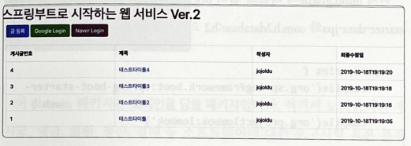

### 01 인텔리제이로 스프링 부트 시작하기

-----

#### 1.4 그레이들 프로젝트를 스프링 부트 프로젝트로 변경하기

<br/>

- 프로젝트의 플러그인 의존성 관리를 위한 설정

```
buildscript {
    ext {
        springBootVersion = '2.1.7.RELEASE'
    }
    repositories {
        mavenCentral()
        jcenter()
    }
    dependencies {
        classpath("org.springframework.boot:spring-boot-gradle-plugin:${springBootVersion}")
    }
}

plugins {
    id 'java'
}

group 'org.example'
version '1.0-SNAPSHOT'

repositories {
    mavenCentral()
}

dependencies {
    testImplementation 'org.junit.jupiter:junit-jupiter-api:5.8.1'
    testRuntimeOnly 'org.junit.jupiter:junit-jupiter-engine:5.8.1'
}

test {
    useJUnitPlatform()
}
```

| 키워드 | 내용                           |
|:----|:-----------------------------|
| ext | build.gradle 에서 사용하는 전역변수 설정 |

<br/>

- 앞서 선언한 프러그인 의존성 적용

```
apply plugin: 'java'
apply plugin: 'eclipse'
apply plugin: 'org.springframework.boot'
apply plugin: 'io.spring.dependency-management'
```

| 키워드 | 내용                      |
|:----|:------------------------|
| io.spring.dependency-management | 스프링 부트의 의존성을 관리해주는 플러그인 |


- 각종 의존성 (라이브러리) 들 추가를 위한 리포지터리 (원격저장소) 추가

```
repositories {
    mavenCentral()
    jcenter()
}

dependencies {
    implementation('org.springframework.boot:spring-boot-starter-web')
    testImplementation('org.springframework.boot:spring-boot-starter-test')
    testImplementation 'org.junit.jupiter:junit-jupiter-api:5.8.1'
    testRuntimeOnly 'org.junit.jupiter:junit-jupiter-engine:5.8.1'
}
```

> 최근엔 업로드 난이도 때문에 jcenter 도 많이 이용함 (직접 만든 라이브러리 업로드할 때 복잡함) <br/>
> dependencies 선언부에서 버전을 명시하지 않아야만  ``org.springframework.boot:spring-boot-gradle-plugin:${springBootVersion}`` 따라감

| 키워드 | 내용                      |
|:----|:------------------------|
| dependencies | 프로젝트 개발에 필요한 의존성 선언하는 곳 |

----
### 02 스프링 부트에서 테스트 코드를 작성하자

- 단위 테스트

| 키워드   | 내용                                                                                                                                                                                     |
|:------|:---------------------------------------------------------------------------------------------------------------------------------------------------------------------------------------|
| 단위테스트 | 기능 단위의 테스트 코드를 작성하는 것                                                                                                                                                                  |
| 장점    | - 개발단계 초기에 문제를 발견하게 도와준다. <br/> - 나중에 리팩토링이나 라이브러리 업그레이드 등에서 기존 기능이 올바르게 작동하는지 확인할 수 있다 (예, 회귀 테스트) <br/> - 기능에 대한 불확실성을 감소시킨다. <br/> - 시스템에 대한 실제 문서를 제공한다. (단위 테스트 자체를 문서로 사용할 수 있음) |

> 단위 테스트는 새로운 기능이 추가될 때, 기존 기능이 잘 작동되는 것을 보장해줌

<br/>

- 대표적 테스트 프레임워크

| 키워드     | 내용   |
|:--------|:-----|
| JUnit   | JAVA |
| DBUnit  | DB   |
| CppUnit | C++  |
| NUnit   | .net |

-----

#### 2.2 Hello Controller 테스트 코드 작성하기

- Application (메인)클래스 추가
```java
import org.springframework.boot.SpringApplication;
import org.springframework.boot.autoconfigure.SpringBootApplication;

@SpringBootApplication
public class Application {
    public static void main(String[] args) {
        SpringApplication.run(Application.class, args);
    }
}
```

| 키워드     | 내용                                                                                                   |
|:--------|:-----------------------------------------------------------------------------------------------------|
| @SpringBootApplication   | - 스프링 부트 자동 설정, 스프링 Bean 읽기와 생성을 모두 자동으로 설정함<br/> - 해당 어노테이션이 선언된 위치부터 설정을 읽어가기 때문에 프로젝트 최상단에서 선언할 것 |
|     SpringApplication.run | 내장 WAS 실행  (서버에 별도의 톰켓 설치 작업을 안해도 됨, 서버 실행 시 JAR Runnable File 만 클릭하면 실행할 수 있음)                      |

<br/>

- 간단한 컨트롤러 구현

```java
package org.example.jodu_01_Starter.controller;

import org.springframework.web.bind.annotation.GetMapping;
import org.springframework.web.bind.annotation.RestController;

@RestController
public class HelloController {

    @GetMapping("/hello")
    public String hello() {
        return "hello";
    }

}
```

> /hello 로 요청이 오면 문자열 hello 를 반환함

| 키워드             | 내용                                                                                                                                               |
|:----------------|:-------------------------------------------------------------------------------------------------------------------------------------------------|
| @RestController | - 컨트롤러를 JSON 을 반환하는 컨트롤러로 만들어줌 <br/> - 예전에 @ResponseBody 를 각 메소드마다 선언했던 것을 한번에 사용할 수 있게 해줌                                                       |
| @GetMapping     | - HTTP Method 인 Get 의 요청을 받을 수 있는 API 를 만들어줌 <br/> - 예전에 @RequestMapping(method = RequestMethod.GET) 으로 사용되던 거                                   |


<br/>

- 테스트 코드 구현

```java
import org.junit.Test;
import org.junit.runner.RunWith;
import org.springframework.beans.factory.annotation.Autowired;
import org.springframework.boot.test.autoconfigure.web.servlet.WebMvcTest;
import org.springframework.test.context.junit4.SpringRunner;
import org.springframework.test.web.servlet.MockMvc;
import org.springframework.test.web.servlet.request.MockMvcRequestBuilders;
import org.springframework.test.web.servlet.result.MockMvcResultMatchers;

@RunWith(SpringRunner.class)
@WebMvcTest(controllers = HelloController.class)
public class HelloControllerTest {

    @Autowired
    private MockMvc mvc;

    @Test
    public void hello() throws Exception {

        String hello = "hello";

        mvc.perform(MockMvcRequestBuilders.get("/hello"))
                .andExpect(MockMvcResultMatchers.status().isOk())
                .andExpect(MockMvcResultMatchers.content().string(hello));
    }

}
```

|키워드| 내용                                                                                                                                                        |
|:---|:----------------------------------------------------------------------------------------------------------------------------------------------------------|
|@RunWith(SpringRunner.class)| - 테스트를 진행할 때 JUnit에 내장된 실행자 외에 파라메타에 선언한 실행자를 실행 <br/> - SpringRunner 는 스프링 실행자를 사용 <br/> - 스프링부트 테스트와 JUnit 사이에 연결자 역할                                   |
| @WebMvcTest  | - 여러 스프링 테스트 어노테이션 중, Web (Spring MVC)에 집중할 수 있는 어노테이션 <br/> - 선언할 경우 @Controller, @ControllerAdvice 등 사용 가능 (@Service, @Component, @Repository 등은 사용 불가) |
| @Autowired  | - 스프링이 관리하는 빈 (Bean)을 주입 받음                                                                                                                               |
| private MockMvc mvc  | - 웹 API 를 테스트할 때 사용 <br/> - 스프링 MVC 테스트의 시작점 <br/> - 이 클래스를 통해 HTTP GET, POST 등에 대한 API 테스트를 할 수 있다.                                                      |
|  mvc.perform(MockMvcRequestBuilders.get("/hello")) | - MockMvc 를 통해 /hello 주소로 HTTP GET 요청을 함 <br/> - 체이닝이 지원되어 여러 검증 기능을 이어서 선언 가능                                                                            |
| .andExpect(MockMvcResultMatchers.status().isOk())  | - mvc.perform 의 결과를 검증 <br/> - HTTP Header 의 Status 를 검증 <br/> - 200, 404, 500 등의 상태 검증 <br/> - 여기선 OK (200) 인지 아닌지를 검중                                   |
| .andExpect(MockMvcResultMatchers.content().string(hello))  | - mvc.perform 의 결과를 검증 <br/> - 응답 본문의 내용을 검증 <br/> - Controller 에서 "hello" 를 리턴하는 지 검증                                                                    |

<br/>
---

#### 2.3 롬복 소개

> 롬복이란? 개발 시 자주 사용하는 Getter, Setter, 기본생성자, toString 등을 어노테이션으로 자동 생성해줌

     implementation 'org.projectlombok:lombok:'

프로젝트마다 build.gradle 라이브러리 추가, Enable annotation processing 체크하기

<br/>

---

#### 2.4 Hello Controller 코드를 롬복으로 전환하기

- HelloResponseDto 추가

```java
package org.example.jodu_01_Starter.dto;

import lombok.Getter;
import lombok.RequiredArgsConstructor;

@Getter
@RequiredArgsConstructor
public class HelloResponseDto {

    private final String name;

    private final int amount;
    
}
```

|keyword| description                                                          |
|:---|:---------------------------------------------------------------------|
|@Getter| - 선언된 모든 필드의 get 메소드를 생성해줌                                           |
|@RequiredArgsConstructor| - 선언된 모든 final 필드가 포함된 생성자를 생성해줌 <br/> - final 이 없는 필드는 생성자에 포함되지 않음 |

<br/>

- HelloResponseDto 테스트 코드 작성

```java
package org.example.jodu_01_Starter.dto;

import org.junit.Test;

import static org.assertj.core.api.AssertionsForClassTypes.assertThat;

public class HelloResponseDtoTest {

    @Test
    public void lombokFunctionTest() {

        /*given*/
        String name = "test";

        int amount = 1000;


        /*when*/
        HelloResponseDto dto = new HelloResponseDto(name, amount);


        /*then*/
        assertThat(dto.getName()).isEqualTo(name);
        assertThat(dto.getAmount()).isEqualTo(amount);

    }
}
```
|keyword| description                                                                                                                 |
|:---|:----------------------------------------------------------------------------------------------------------------------------|
|assertThat| - assertj 라는 테스트 검증 라이이브러리의 검증 메소드임. <br/> - 검증하고 싶은 대상을 매서드 인자로 받음 <br/> - 메소드 체이닝이 지원되어 isEqualTo 와 같이 메소드를 이어서 사용할 수 있다. |
|isEqualTo| - assertj 의 동등 비교 메소드임. <br/> - assertThat 에 있는 값과 isEqaulTo 의 값을 비교해서 같을 때만 성공!                                            |

> JUnit 과 비교했을 때 assertj 의 장점
> - CoreMatchers 와 달리 추가적으로 라이브러리가 필요하지 않다.
>   - Junit 의 assertThat 을 쓰게 되면 is() 와 같이 CoreMatchers 라이브러리가 필요하다.
> - 자동완성이 좀 더 확실하게 지원된다.
>   - IDE 에서는 CoreMatchers 와 같은 Mather 라이브러리의 자동완성 지원이 약하다.

- 실행결과


<br/>

- HelloController 에서 ResponseDTO 사용

```java
    @GetMapping("/hello/dto")
    public HelloResponseDto HelloDto(@RequestParam("name") String name, @RequestParam("amount") int amount) {
        return new HelloResponseDto(name, amount);
    }
```
|keyword| description                                                                                                                            |
|:---|:---------------------------------------------------------------------------------------------------------------------------------------|
|@ReqeustParam| - 외부에서 API 로 넘긴 파라미터를 가져오는 어노테이션임 <br/> - 여기서는 외부에서 name (@RequestParam("name")) 이란 이름으로 넘긴 파라미터를 메소드 파라미터 name(String name) 에 저장하게 됨. |

<br/>

- HelloController API 테스트 

```java
package org.example.jodu_01_Starter.controller;

import org.junit.Test;
import org.junit.runner.RunWith;
import org.springframework.beans.factory.annotation.Autowired;
import org.springframework.boot.test.autoconfigure.web.servlet.WebMvcTest;
import org.springframework.test.context.junit4.SpringRunner;
import org.springframework.test.web.servlet.MockMvc;
import org.springframework.test.web.servlet.request.MockMvcRequestBuilders;
import org.springframework.test.web.servlet.result.MockMvcResultMatchers;

import static org.hamcrest.Matchers.is;
import static org.springframework.test.web.servlet.result.MockMvcResultMatchers.jsonPath;

@RunWith(SpringRunner.class)
@WebMvcTest(controllers = HelloController.class)
public class HelloControllerTest {

    @Autowired
    private MockMvc mvc;

    @Test
    public void hello() throws Exception {

        String hello = "hello";

        mvc.perform(MockMvcRequestBuilders.get("/hello"))
                .andExpect(MockMvcResultMatchers.status().isOk())
                .andExpect(MockMvcResultMatchers.content().string(hello));
    }

    @Test
    public void HelloDto_return() throws Exception {

        String name = "hello";

        int amount = 1000;

        mvc.perform(MockMvcRequestBuilders.get("/hello/dto").param("name", name).param("amount", String.valueOf(amount)))
                .andExpect(MockMvcResultMatchers.status().isOk())
                .andExpect(jsonPath("$.name", is(name)))
                .andExpect(jsonPath("$.amount", is(amount)));


    }

}
```

| keyword  | description                                                                                                             |
|:---------|:------------------------------------------------------------------------------------------------------------------------|
| param    | - API 테스트할 때 사용될 요청 파라미터를 설정한다. <br/> - 값은 String 만 허용됨 <br/> - 따라서 숫자/날짜 등의 데이터를 등록할 때는 문자열로 변경해야 함                    |
| jsonPath | - JSON 응답값을 필드별로 검증할 수 있는 메서드이다. <br/> - $ 을 기준으로 필드명을 명시한다. <br/> - 여기서는 bane 과 amount 를 검증하니 $.name, $.amount 로 검증한다. |

- api 테스트 결과


----
### 03 스프링부트에서 JPA로 데이터베이스 다뤄보자

> - MyBatis, iBatis: SQL 매퍼
> - JPA : ORM (Object Relational Mapping)

#### JPA 소개

|키워드| 내용                                                                          |
|:---|:----------------------------------------------------------------------------|
|RDB| 어떻게 데이터를 저장할지에 초점                                                           |
|객체지향 프로그래밍 언어| 메시지를 기반으로 기능과 속성을 한 곳에서 관리하는 기술 -> 패러다임 불일치                                 |
|JPA| 객체지향적으로 프로그래밍하고 SQL을 대신 생성 -> SQL 독립적으로 개발 가능                               |
|Spring Data JPA| JPA <- Hibernate <- Spring Data JPA  <br/> - 구현 교체의 용이성 <br/> - 저장소 교체의 용이성 |

> - 구현교체의 용이성: 유행이 지나면 Hibernate 외에 다른 구현체로 쉽게 교체하기 위함 <br/>
> - 저장소 교체의 용이성: 관계형 데이터베이스 외에 다른 저장소로 쉽게 교체하기 위함 <br/>
> -> 서비스 초기엔 RDB로 모든 기능 처리 가능하지만 트래픽 커질 수록 RDB로 감당 안됨 (MongoDB로 교체 필요성 spring data mongodb로 의존성 교체)
> - save(), findAll().. 등의 인터페이스를 사용하는 경우 저장소가 교체되어도 기본적인 기능은 변경할 것이 없다.

---

#### 요구사항 분석

| 게시판 기능 | 회원 기능            |
|:-------|:-----------------|
| 게시글 조회 | 구글/네이버 로그인       |
| 게시글 등록 | 로그인한 사용자 글 작성 권한 |
| 게시글 수정 | 본인 작성 글에 대한 권한 관리 |
| 게시글 삭제 |                  |

<br/>




------

#### 3.2 프로젝트에 Spring Data Jpa 적용하기

- spring-boot-starter-data-jpa, com.h2database:h2 의존성 등록
```
implementation 'org.springframework.boot:spring-boot-starter-data-jpa'
implementation 'com.h2database:h2'
```

|키워드| 내용                                                                                                                     |
|:---|:-----------------------------------------------------------------------------------------------------------------------|
|spring-boot-starter-data-jpa| - 스프링 부트용 Spring Data Jpa 추상화 라이브러리 <br/> - 스프링 부트 버전에 맞춰 자동으로 JPA 관련 라이브러리들의 버전을 관리해줌                                 |
|h2| - 인메모리 RDB <br/> - 별도의 설치가 필요 없이 프로젝트 의존성만으로 관리 가능 <br/> - 메모리에서 실행되기 때문에 애플리케이션 재시작할 때마다 초기화된다는 점을 이용하여 테스트 용도로 주로 사용 |

<br/>

- Domain (Entity) 클래스 작성

```java
import lombok.AllArgsConstructor;
import lombok.Builder;
import lombok.Getter;
import lombok.NoArgsConstructor;

import javax.persistence.*;

@Builder
@NoArgsConstructor
@AllArgsConstructor
@Getter
@Entity
public class Posts {

    @Id
    @GeneratedValue(strategy = GenerationType.IDENTITY)
    private Long id;

    @Column(length = 500, nullable = false)
    private String title;

    @Column(columnDefinition = "TEXT", nullable = false)
    private String content;

    private String author;

}
```

| 키워드                | 내용                                                                                                                                                                            |
|:-------------------|:------------------------------------------------------------------------------------------------------------------------------------------------------------------------------|
| Entity             | - 데이블과 링크될 클래스임을 나타냄 <br/> - 기본값으로 클래스의 카멜케이스 이름을 언더스코어 네이밍 (_) 으로 데이블 이름을 매칭 <br/> - ex) SalesManager.java -> sales_manager table                                            |
| @Id                | - 해당 테이블의 PK 필드를 나타냄                                                                                                                                                          |
| @GeneratedValue    | - PK의 생성 규칙을 나타냄 <br/> - 스프링부트 2.0 에서는 GenerationType.IDENTITY 옵션을 추가해야만 auto_increment 가 됨                                                                                   |
| @Column            | - 테이블의 칼럼을 나타내며 굳이 선언하지 않더라도 해당 클래스의 필드는 모두 칼럼이 됨 <br/> - 기본값 외에 추가로 변경이 필요한 옵션이 있으면 사용 <br/> - 문자열의 경우 VARCHAR(255) 가 기본값인데, 사이즈를 500으로 늘리고 싶거나 타입을 TEXT로 변경하고 싶거나 등의 경우에 사용 |
| @NoArgsConstructor | - 기본 생성자 자동 추가 <br/> - Constructor 와 같은 효과                                                                                                                                    |
| @Getter            | - 클래스 내 모든 필드의 Getter 메소드를 자동 생성                                                                                                                                              |
|@Builder| - 해당 클래스의 빌더 패턴 클래스를 생성 <br/> - 생성자 상단에 선언 시 생성자에 포함된 필드만 빌더에 포함                                                                                                              |

> Entity 클래스에서 절대 Setter 메소드를 만들지 마라. 대신, 해당 필드의 값 변경 필요시 명확히 그 목적과 의도를 나타낼 수 있는 메소드를 추가해라

<br/>

- 잘못된 사용 예

```java
public class Order {
    public void setStatus (boolean status) {
        this.status = status;
    }
    
    public void 주문서비스의_취소이벤트() {
        order.setStatus(false);
    }
}
```


- 올바른 사용 에
```java
public class Order {
    public void cancelOrder () {
        this.status = false;
    }
    
    public void 주문서비스의_취소이벤트() {
        order.cancelOrder();
    }
}
```

<br/>

- JpaRepository 생성

|키워드| 내용                     |
|:---|:-----------------------|
|JpaRepository| Posts 클래스로 DB에 접근하게 해줌 |

> JPA 에선 Repository 라고 부르며 인터페이스로 생성됨. 반면 ibatis 나 MyBatis 등에서 DAO 라고 불림 <br/>
> JpaRepository<Entity, PK Type> 을 상속하면 기본적인 CRUD 메소드가 자동으로 생성됨 <br/>
> 나중에 프로젝트 규모가 커져 도메인별로 프로젝트를 분리해야 한다면 Entity 클래스와 기본 Repository 는 함께 움직여야 하므로 도메인 패키지에서 함께 관리할 것

---

#### 3.3 Spring Data JPA 테스트 코드 작성하기

```java
import org.junit.After;
import org.junit.Test;
import org.junit.runner.RunWith;
import org.springframework.beans.factory.annotation.Autowired;
import org.springframework.boot.test.context.SpringBootTest;
import org.springframework.test.context.junit4.SpringRunner;

import java.util.List;

import static org.assertj.core.api.AssertionsForClassTypes.assertThat;

@RunWith(SpringRunner.class)
@SpringBootTest
public class PostRepositoryTest {

    @Autowired
    PostsRepository postsRepository;

    @After
    public void cleanup() {
        postsRepository.deleteAll();
    }

    @Test
    public void 게시글저장_불러오기() {

        // given
        String title = "테스트 게시글";
        String content = "테스트 본문";

        postsRepository.save(Posts.builder()
                .title(title)
                .content(content)
                .author("jojodu@gmail.com")
                .build());

        // when
        List<Posts> postsList = postsRepository.findAll();

        // then
        Posts posts = postsList.get(0);
        assertThat(posts.getTitle()).isEqualTo(title);
        assertThat(posts.getContent()).isEqualTo(content);

    }

}
```

| 키워드    | 내용                                                                                                                                                                      |
|:-------|:------------------------------------------------------------------------------------------------------------------------------------------------------------------------|
| @After | - Junit 에서 단위 테스트가 끝날 때마다 수행되는 메소드를 지정 <br/> - 보통은 배포 전 전체 테스트를 수행할 때 테스트간 데이터 침범을 막기 위해 사용 <br/> - 여러 테스트가 동시에 수행되면 DB 인 H2 에 데이터가 그대로 남아 있어 다음 테스트 실행 시 테스트가 실패할 수 있다 |
| postsRepository.save       | - 테이블 posts 에 insert/update 쿼리를 실행한다 <br/> - id 값이 있다면 update 가 없다면 insert 쿼리가 실행된다                                                                                     |
|  postsRepository.findAll      | - 테이블 posts 에 잇는 모든 데이터를 조회해오는 메소드이다                                                                                                                                    |

> - 실행된 쿼리 로그 확인: ```spring.jpa.show-sql=true```

> - 출력되는 쿼리 로그를 MySQL 버전으로 변경 : ```spring.jpa.properties.hibernate.dialect=org.hibernate.dialect.MySQL5InnoDBDialect```

---

#### 3.4 등록/수정/조회 API 만들기

- API 만들기 위해 총 3개의 클래스 필요
> - Request 데이터를 받을 DTO
> - API 요청을 받을 Controller
> - 트랜잭션, 도메인 기능 간의 순서를 보장하는 Service


> - Web Layer
>     - 흔히 사용하는 컨트롤러 (@Controller)와 JPS/Freemaker 등의 뷰 템플릿 영역임.
>     - 이외에도 필터 (@Filter), 인터셉터, 컨트롤러 어드바이스 (@Controller/Advice) 등 외부 요청과 응답에 대한 전반적인 영역을 이야기함
> - Service Layer
>   - @Service 에 사용되는 서비스 영역이다.
>   - 일반적으로 Controller 와 DAO 의 중간 영역에서 사용됨.
>   - @Transactional 이 사용되어야 하는 영역이기도 함
> - Repository Layer
>   - Database 와 같이 데이터 저장소에 접근하는 영역임
>   - 기존에 DAO (Data Access Object) 영역으로 이해하면 됨
> - Dtos
>   - Dto (Data Transfer Object)는 계층 간에 데이터 교환을 위한 객체를 이야기하며 Dtos 는 이들의 영역을 애기함
>   - 예를 들어 뷰 템플릿 엔진에서 사용될 객체나 Repository Layer 에서 결과로 넘겨준 객체 등이 이들을 말함.
> - Domain Model
>   - 도메인이라 불리는 개발 대상을 모든 사람이 동일한 관점에서 이해할 수 있고 공유할 수 있도록 단순화시킨 것을 도메인 모델이라고 한다
>   - 예를 들어 택시 앱의 경우 배차, 탑승, 요금 등이 모두 도메인이 될 수 있다
>   - @Entity 가 사용된 영역 역시 도메인 모델이라고 이해하면 됨
>   - 다만, 무조건 데이터베이스의 테이블과 관계가 있어야 하는 것은 아니다
>   - VO 처럼 값 객체들도 이 영역에 해당됨

<br/>

- 도메인 계층에서 로직을 처리하는 이유 <br/> 
 -ex) 주문 취소 로직

- 슈도 코드
```java
@Transactional
public Order cancelOrder(int orderId){
        // 데이터베이스로부터 주문정보, 결제정보, 배송정보 조회
        // 배송 취소 해야 하는지 확인
        // 배송중이라면 취소로 변경
        // 각 테이블에 취소 상태 Update
}
```

- 서비스 계층에서 모든 로직을 처리할 경우
```java
@Transactional
public Order cancelOrder(int orderId){
    
    OrderDto order = ordersDao.selectOrders(orderId);
    BillingDto billing = billingDao.selectBilling(orderId);
    DeliveryDto delivery = deliveryDao.selectDelivery(orderId);
        
    String deliveryStatus = delivery.getStatus();
    
    if("IN_PROGRESS".equals(deliveryStatus)) {
        delivery.setStatus("CANCEL");
        deliveryDao.update(delivery);
    }
    
    order.setStatus("CANCEL");
    ordersDao.update(order);
    
    billing.setStatus("CANCEL");
    deliveryDao.update(billing);
    
    return order;
}
```

> 모든 로직이 서비스 클래스 내부에서 처리됨. 그러다 보니 서비스 계층이 무의미하며, 객체란 단순 데이터 덩어리 역할만..

- 로직을 도메인 모델에서 처리할 경우

```java
@Transactional
public Order cancelOrder(int orderId) {
    
    Orders order = ordersRepository.findById(orderId);
    Billing billing = billingRepository.findByOrderId(orderId);
    Delivery delivery = deliveryRepository.findByOrderId(orderId);
    
    delivery cancel();
    
    order.cancel();
    billing.cancel();
    
    return order;
    
}
```

> order, billing, delivery 가 각자 본인의 취소 이벤트 처리를 하며, 서비스 메소드는 트랜잭션과 도메인 간의 순서만 보장해 준다.

<br/>

---

###### 등록, 수정, 삭제 기능 만들기

---

#### - 등록 기능
- PostApiController

```java
import lombok.RequiredArgsConstructor;
import org.example.jodu_01_Starter.service.posts.PostsService;
import org.example.jodu_01_Starter.web.dto.PostSaveRequestDto;
import org.springframework.web.bind.annotation.PostMapping;
import org.springframework.web.bind.annotation.RequestBody;
import org.springframework.web.bind.annotation.RestController;

@RequiredArgsConstructor
@RestController
public class PostApiController {

    private final PostsService postsService;

    @PostMapping("/api/v1/posts")
    public Long save(@RequestBody PostSaveRequestDto requestDto) {

        return postsService.save(requestDto);

    }

}
```

- PostsService
```java
import lombok.RequiredArgsConstructor;
import org.example.jodu_01_Starter.domain.posts.PostsRepository;
import org.example.jodu_01_Starter.web.dto.PostSaveRequestDto;
import org.springframework.stereotype.Service;

import javax.transaction.Transactional;

@RequiredArgsConstructor
@Service
public class PostsService {

    private final PostsRepository postsRepository;

    @Transactional
    public Long save(PostSaveRequestDto requestDto) {

        return postsRepository.save(requestDto.toEntity()).getId();

    }

}
```

> @RequiredArgsConstructor: final 이 선언된 모든 필드를 인자값으로 하는 생성자를 생성해줌 (bean 으로 등록)

- PostsSaveRequestDto

```java
import lombok.AllArgsConstructor;
import lombok.Builder;
import lombok.Getter;
import lombok.NoArgsConstructor;
import org.example.jodu_01_Starter.domain.posts.Posts;

@Getter
@NoArgsConstructor
@AllArgsConstructor
@Builder
public class PostSaveRequestDto {

    private String title;

    private String content;

    private String author;


    public Posts toEntity() {
        return Posts.builder()
                .title(title)
                .content(content)
                .author(author)
                .build();
    }
}
```

- PostsApiControllerTest

```java
import org.example.jodu_01_Starter.domain.posts.Posts;
import org.example.jodu_01_Starter.domain.posts.PostsRepository;
import org.example.jodu_01_Starter.web.dto.PostsSaveRequestDto;
import org.junit.After;
import org.junit.Test;
import org.junit.runner.RunWith;
import org.springframework.beans.factory.annotation.Autowired;
import org.springframework.boot.test.context.SpringBootTest;
import org.springframework.boot.test.web.client.TestRestTemplate;
import org.springframework.boot.web.server.LocalServerPort;
import org.springframework.http.HttpStatus;
import org.springframework.http.ResponseEntity;
import org.springframework.test.context.junit4.SpringRunner;

import java.util.List;

import static org.assertj.core.api.AssertionsForClassTypes.assertThat;

@RunWith(SpringRunner.class)
@SpringBootTest(webEnvironment = SpringBootTest.WebEnvironment.RANDOM_PORT)
public class PostsApiControllerTest {

    @LocalServerPort
    private int port;

    @Autowired
    private TestRestTemplate restTemplate;

    @Autowired
    private PostsRepository postsRepository;

    @After
    public void tearDown() throws Exception {
        postsRepository.deleteAll();
    }

    @Test
    public void Posts_등록된다() throws Exception {

        // given
        String title = "title";
        String content = "content";

        PostsSaveRequestDto requestDto = PostsSaveRequestDto.builder()
                .title(title)
                .content(content)
                .author("author")
                .build();

        String url = "http://localhost:" + port + "/api/v1/posts";

        // when
        ResponseEntity<Long> responseEntity = restTemplate.postForEntity(url, requestDto, Long.class);

        // then
        assertThat(responseEntity.getStatusCode()).isEqualTo(HttpStatus.OK);
        assertThat(responseEntity.getBody()).isGreaterThan(0L);

        List<Posts> all = postsRepository.findAll();
        assertThat(all.get(0).getTitle()).isEqualTo(title);
        assertThat(all.get(0).getContent()).isEqualTo(content);

    }
}
```

> Api Controller 테스트를 하는 경우 @WebMvcTest 를 사용하지 않는데 @Web..의 경우 JPA 기능이 작동하지 않음, 외부 연동과 관련된 부분만 활성화됨

---

#### 수정 / 조회 기능

- PostApiController

```java
import lombok.RequiredArgsConstructor;
import org.example.jodu_01_Starter.service.posts.PostsService;
import org.example.jodu_01_Starter.web.dto.PostsResponseDto;
import org.example.jodu_01_Starter.web.dto.PostsSaveRequestDto;
import org.example.jodu_01_Starter.web.dto.PostsUpdateRequestDto;
import org.springframework.web.bind.annotation.*;

@RequiredArgsConstructor
@RestController
public class PostApiController {

    private final PostsService postsService;


    /*등록한다*/
    @PostMapping("/api/v1/posts")
    public Long save(@RequestBody PostsSaveRequestDto requestDto) {

        return postsService.save(requestDto);

    }


    /*수정한다*/
    @PutMapping("/api/v1/posts/{id}")
    public Long update(@PathVariable Long id, @RequestBody PostsUpdateRequestDto requestDto) {

        return postsService.update(id, requestDto);

    }


    /*조회한다*/
    @GetMapping("/api/v1/posts/{id}")
    public PostsResponseDto findById(@PathVariable Long id) {

        return postsService.findById(id);

    }

}
```


|키워드| 내용              |
|:---|:----------------|
|@PathVariable| url의 {?} 부분에 접근 |

<br/>

- PostsResponseDto

```java
import lombok.Builder;
import lombok.Getter;
import org.example.jodu_01_Starter.domain.posts.Posts;

@Getter
public class PostsResponseDto {

    private Long id;
    private String title;
    private String content;
    private String author;

    public PostsResponseDto(Posts entity) {
        this.id = entity.getId();
        this.title = entity.getTitle();
        this.content = entity.getContent();
        this.author = entity.getAuthor();
    }
    
}
```

<br/>

- PostsUpdateRequestDto

```java
import lombok.AllArgsConstructor;
import lombok.Builder;
import lombok.Getter;
import lombok.NoArgsConstructor;

@Getter
@AllArgsConstructor
@NoArgsConstructor
@Builder
public class PostsUpdateRequestDto {

    private String title;
    private String content;

}
```

<br/>

- Posts

```java
import lombok.AllArgsConstructor;
import lombok.Builder;
import lombok.Getter;
import lombok.NoArgsConstructor;

import javax.persistence.*;

@Builder
@NoArgsConstructor
@AllArgsConstructor
@Getter
@Entity
public class Posts {

    @Id
    @GeneratedValue(strategy = GenerationType.IDENTITY)
    private Long id;

    @Column(length = 500, nullable = false)
    private String title;

    @Column(columnDefinition = "TEXT", nullable = false)
    private String content;

    private String author;

    public void update(String title, String content) {
        this.title = title;
        this.content = content;
    }
}
```

<br/>

- PostsService

```java
import lombok.RequiredArgsConstructor;
import org.example.jodu_01_Starter.domain.posts.Posts;
import org.example.jodu_01_Starter.domain.posts.PostsRepository;
import org.example.jodu_01_Starter.web.dto.PostsResponseDto;
import org.example.jodu_01_Starter.web.dto.PostsSaveRequestDto;
import org.example.jodu_01_Starter.web.dto.PostsUpdateRequestDto;
import org.springframework.stereotype.Service;

import javax.transaction.Transactional;

@RequiredArgsConstructor
@Service
public class PostsService {

    private final PostsRepository postsRepository;

    @Transactional
    public Long save(PostsSaveRequestDto requestDto) {

        return postsRepository.save(requestDto.toEntity()).getId();

    }


    @Transactional
    public Long update(Long id, PostsUpdateRequestDto requestDto) {

        Posts posts = postsRepository.findById(id).orElseThrow(() ->new IllegalArgumentException("해당 게시글이 없습니다. id="+ id));

        posts.update(requestDto.getTitle(), requestDto.getContent());

        return id;

    }


    public PostsResponseDto findById(Long id) {

        Posts entity = postsRepository.findById(id).orElseThrow(() ->new IllegalArgumentException("해당 게시글이 없습니다. id="+ id));

        return new PostsResponseDto(entity);
        
    }

}
```

> update 기능에서 데이터베이스에 쿼리를 날리는 부분이 없음 -> JPA 의 영속성 컨텍스트 때문 <br/>
> 영속성 컨텍스트란, 엔티티를 영구 저장하는 환경임. 트랜잯션이 끝나는 시점에 해당 테이블에 변경분을 반영함.

<br/>

- 수정 테스트 PostsApiControllerTest

```java
import org.example.jodu_01_Starter.domain.posts.Posts;
import org.example.jodu_01_Starter.domain.posts.PostsRepository;
import org.example.jodu_01_Starter.web.dto.PostsSaveRequestDto;
import org.example.jodu_01_Starter.web.dto.PostsUpdateRequestDto;
import org.junit.After;
import org.junit.Test;
import org.junit.runner.RunWith;
import org.springframework.beans.factory.annotation.Autowired;
import org.springframework.boot.test.context.SpringBootTest;
import org.springframework.boot.test.web.client.TestRestTemplate;
import org.springframework.boot.web.server.LocalServerPort;
import org.springframework.http.HttpEntity;
import org.springframework.http.HttpMethod;
import org.springframework.http.HttpStatus;
import org.springframework.http.ResponseEntity;
import org.springframework.test.context.junit4.SpringRunner;

import java.util.List;

import static org.assertj.core.api.AssertionsForClassTypes.assertThat;

@RunWith(SpringRunner.class)
@SpringBootTest(webEnvironment = SpringBootTest.WebEnvironment.RANDOM_PORT)
public class PostsApiControllerTest {

    @LocalServerPort
    private int port;

    @Autowired
    private TestRestTemplate restTemplate;

    @Autowired
    private PostsRepository postsRepository;

    @After
    public void tearDown() throws Exception {
        postsRepository.deleteAll();
    }


    // ...
 
    @Test
    public void Posts_수정된다() throws Exception {
        //given
        Posts savedPosts = postsRepository.save(Posts.builder()
                .title("title")
                .content("content")
                .author("author")
                .build());

        Long updateId = savedPosts.getId();
        String expectedTitle = "title2";
        String expectedContent = "content2";

        PostsUpdateRequestDto requestDto = PostsUpdateRequestDto.builder()
                .title(expectedTitle)
                .content(expectedContent)
                .build();

        String url = "http://localhost:" + port + "/api/v1/posts/"+ updateId;

        HttpEntity<PostsUpdateRequestDto> requestEntity = new HttpEntity<>(requestDto);

        // when
        ResponseEntity<Long> responseEntity = restTemplate.exchange(url, HttpMethod.PUT, requestEntity, Long.class);

        // then
        assertThat(responseEntity.getStatusCode()).isEqualTo(HttpStatus.OK);
        assertThat(responseEntity.getBody()).isGreaterThan(0L);

        List<Posts> all = postsRepository.findAll();
        assertThat(all.get(0).getTitle()).isEqualTo(expectedTitle);
        assertThat(all.get(0).getContent()).isEqualTo(expectedContent);

    }
}
```

---

<br/>

#### H2 데이터베이스를 로컬 환경에서 접근

- properties 추가
```
spring.h2.console.enabled=true
```

- http://localhost:8080/h2-console 로 접속


- 데이터 입력


- API 요청


<br/>

----

<br/>

#### 3.5 JPA Auditing 으로 생성시간 / 수정시간 자동화하기

|키워드| 내용                                                  |
|:---|:----------------------------------------------------|
|JPA Auditing| 엔티티에 특정 작업이 insert, update 될 때마다 반복되는 코드를 자동화할 때 사용 |

- LocalDate 사용

```java
@Getter
@MappedSuperclass
@EntityListeners(AuditingEntityListener.class)
public class BaseTimeEntity {

    @CreatedDate
    private LocalDateTime createdDate;

    @LastModifiedDate
    private LocalDateTime modifiedDate;

}
```

> BaseTimeEntity 클래스는 모든 Entity 의 상위 클래스가 되어 Entity 들의 createdDate, modifiedDate 를 자동으로 관리하는 역할을 한다.

| 키워드                                            | 내용                                                                                       |
|:-----------------------------------------------|:-----------------------------------------------------------------------------------------|
| @MappedSuperclass                              | JPA Entity 클래스들이 BaseTimeEntity 을 상속할 경우 필드들 (createdDate, modifiedDate) 도 칼럼으로 인식하도록 한다 |
| @EntityListeners(AuditingEntityListener.class) | BaseTimeEntity 클래스에 Auditing 기능을 포함시킨다                                                   |
| @CreatedDate                                   | Entity 가 생성되어 저장될 때 시간이 자동 저장된다                                                          |
| @LastModifiedDate                              | 조회한 Entity 의 값을 변경할 때 시간이 자동 저장된다                                                        |


- Posts entity 클래스에 상속해줌
```java
// ...
public class Posts extends BaseTimeEntity {
    // ...
}
// ...
```

- Application 클래스에서 JPA Auditing 어노테이션을 활성화
```java
import org.springframework.boot.SpringApplication;
import org.springframework.boot.autoconfigure.SpringBootApplication;
import org.springframework.data.jpa.repository.config.EnableJpaAuditing;

@EnableJpaAuditing // JPA Auditing 활성화
@SpringBootApplication
public class Application {
    public static void main(String[] args) {
        SpringApplication.run(Application.class, args);
    }
}

```

<br/>

- JPA Auditing 테스트 코드 작성하기 (PostRepositoryTest)

```java
    @Test
    public void BaseTimeEntity_등록() {

        // given
        LocalDateTime now = LocalDateTime.of(2022,8,22,0,0,0);
        postsRepository.save(Posts.builder()
                .title("title")
                .content("content")
                .author("author")
                .build());

        // when
        List<Posts> postsList = postsRepository.findAll();

        // then
        Posts posts = postsList.get(0);

        System.out.println("VVVVVVVVVVVVVVVVVVVVVVVVVVVVVVVVVVVVVVVVVVVVVVVVVVVVVVVVVVVVVVVVvv");
        System.out.println(">>>>>> createDate="+posts.getCreatedDate());
        System.out.println(">>>>>> modifiedDate="+posts.getModifiedDate());

        assertThat(posts.getCreatedDate()).isAfter(now);
        assertThat(posts.getModifiedDate()).isAfter(now);

    }
```


|키워드|내용|
|:---|:---|
|||


